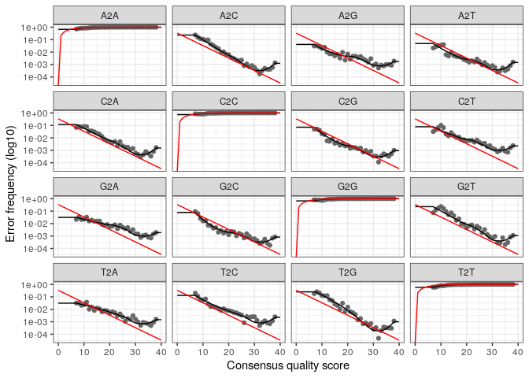
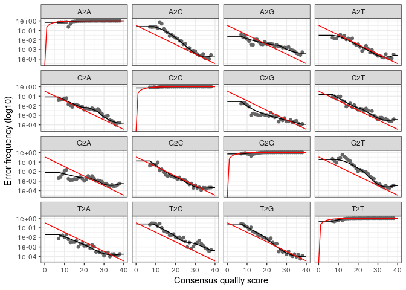
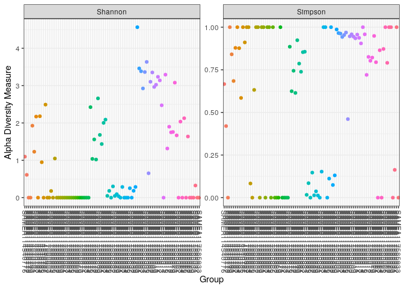
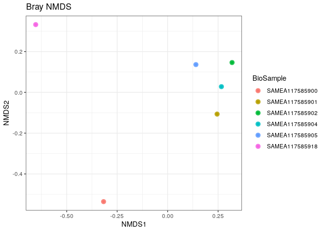
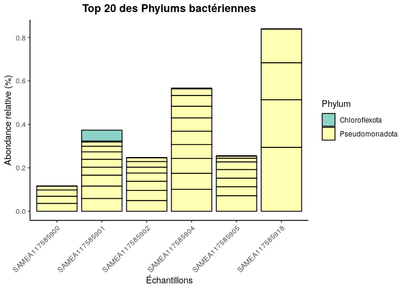
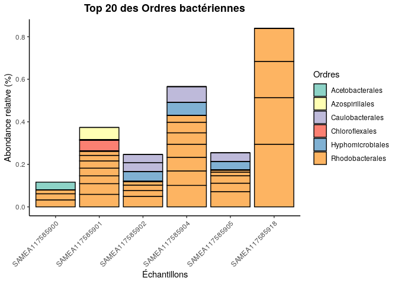
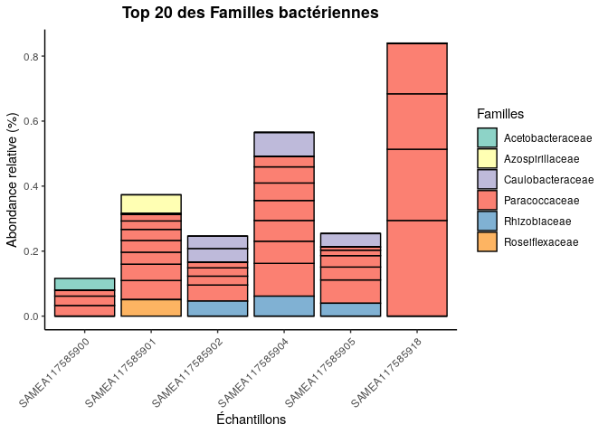
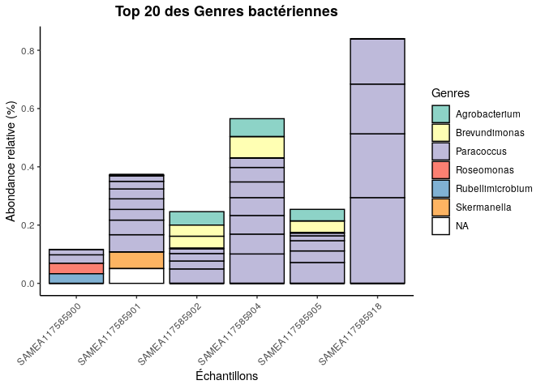
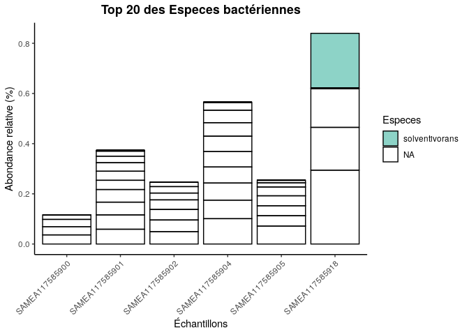

Article analysé : Rauer L. et al. (2025). De-biasing microbiome
sequencing data: bacterial morphology-based correction of extraction
bias and correlates of chimera formation.

Auteurs : Ousmane SOW et Mamadou Demba BA Affiliation : Master 1 MFA,
UBO Brest Professeur : Loïs Maignien

1_Problématique et objectif

Le séquençage du gène 16S rRNA est très utilisé pour étudier le
microbiome, mais les résultats peuvent être faussés par des biais
techniques, notamment lors de l’extraction de l’ADN. Ce biais
d’extraction modifie les abondances relatives des bactéries et rend les
comparaisons entre études difficiles. Il n’existait jusqu’à présent
aucune méthode permettant de corriger ce biais dans les échantillons
environnementaux.

L’objectif de cet article est d’étudier l’effet des protocoles
d’extraction sur la composition du microbiome et de proposer une méthode
pour corriger le biais d’extraction à partir de la morphologie des
bactéries.

2_Matériel et Méthodes

Les auteurs utilisent des communautés bactériennes artificielles (mocks)
dont la composition est connue, sous forme de cellules entières et d’ADN
purifié. Ces échantillons sont traités avec différents protocoles
d’extraction combinant plusieurs kits, conditions de lyse et buffers.
Après séquençage du gène 16S rRNA, les données sont analysées avec
DADA2. Le biais d’extraction est mesuré en comparant les mocks
cellulaires aux mocks ADN et est relié aux caractéristiques
morphologiques des bactéries.

3_Résultats principaux

La composition du microbiome différait significativement selon les kits
d’extraction et les conditions de lyse, mais pas selon les tampons.
Indépendamment du protocole d’extraction, la formation de chimères
augmentait avec des nombres de cellules d’entrée plus élevés. Les
contaminants provenaient majoritairement des tampons, et une
contamination croisée importante a été observée dans les échantillons à
faible quantité de matériel initial. La comparaison de la composition du
microbiome des cell mocks avec celle des DNA mocks correspondants a
révélé un biais d’extraction dépendant du protocole et spécifique des
taxons. De manière remarquable, ce biais d’extraction, spécifique à
chaque espèce, pouvait être prédit à partir de la morphologie cellulaire
bactérienne. Une correction computationnelle du biais d’extraction basée
sur la morphologie a significativement amélioré les compositions
microbiennes obtenues lorsqu’elle était appliquée à différents
échantillons mock, y compris avec des taxons différents. L’application
d’une correction équivalente aux échantillons cutanés a montré un impact
substantiel sur les compositions du microbiome.

4_Conclusion

Cet article montre qu’il est possible de corriger le biais d’extraction
en microbiome 16S en utilisant des caractéristiques simples des
bactéries, comme la morphologie. Cette approche améliore la qualité des
données et représente une avancée importante pour rendre les études de
microbiome plus comparables.

Nous avons réalisé l’analyse bioinformatique des données de séquençage
du gène 16S rRNA issues de l’article de Rauer et al. (2025), intitulé «
De-biasing microbiome sequencing data: bacterial morphology-based
correction of extraction bias and correlates of chimera formation », en
utilisant le pipeline DADA2 et le package phyloseq sous R.

Cette analyse a compris le contrôle qualité des lectures de séquençage,
l’inférence des variants de séquence exacts (ASV), l’assignation
taxonomique, ainsi que l’analyse de la diversité microbienne à
différents niveaux taxonomiques, du phylum jusqu’à l’espèce. Nous avons
également réalisé la visualisation de la diversité alpha à l’aide des
indices de Shannon et de Simpson en fonction des groupes d’échantillons.

5_Analyse Bioinformatique (DADA2 et Phyloseq)

La section suivante décrit en détail les différentes étapes du
traitement bioinformatique ainsi que les analyses réalisées a l’aide de
DADA2 et Phyloseq.

Chargement du package DADA2 et affichage de sa version

``` r
library(dada2); packageVersion("dada2")
```

    ## Loading required package: Rcpp

    ## [1] '1.28.0'

Définition du chemin vers le répertoire contenant les fichiers FASTQ et
affichage de leur liste

``` r
path <- "~/article" # CHANGE ME to the directory containing the fastq files after unzipping.
list.files(path)
```

    ##   [1] "CC2-DADA2_cache"                                                 
    ##   [2] "CC2-DADA2.Rmd"                                                   
    ##   [3] "ena-file-download-read_run-PRJEB67827-fastq_ftp-20260101-1524.sh"
    ##   [4] "ERR12157629_1.fastq.gz"                                          
    ##   [5] "ERR12157629_2.fastq.gz"                                          
    ##   [6] "ERR12157630_1.fastq.gz"                                          
    ##   [7] "ERR12157630_2.fastq.gz"                                          
    ##   [8] "ERR12157631_1.fastq.gz"                                          
    ##   [9] "ERR12157631_2.fastq.gz"                                          
    ##  [10] "ERR12157632_1.fastq.gz"                                          
    ##  [11] "ERR12157632_2.fastq.gz"                                          
    ##  [12] "ERR12157633_1.fastq.gz"                                          
    ##  [13] "ERR12157633_2.fastq.gz"                                          
    ##  [14] "ERR12157634_1.fastq.gz"                                          
    ##  [15] "ERR12157634_2.fastq.gz"                                          
    ##  [16] "ERR12157635_1.fastq.gz"                                          
    ##  [17] "ERR12157635_2.fastq.gz"                                          
    ##  [18] "ERR12157636_1.fastq.gz"                                          
    ##  [19] "ERR12157636_2.fastq.gz"                                          
    ##  [20] "ERR12157637_1.fastq.gz"                                          
    ##  [21] "ERR12157637_2.fastq.gz"                                          
    ##  [22] "ERR12157638_1.fastq.gz"                                          
    ##  [23] "ERR12157638_2.fastq.gz"                                          
    ##  [24] "ERR12157639_1.fastq.gz"                                          
    ##  [25] "ERR12157639_2.fastq.gz"                                          
    ##  [26] "ERR12157640_1.fastq.gz"                                          
    ##  [27] "ERR12157640_2.fastq.gz"                                          
    ##  [28] "ERR14121472_1.fastq.gz"                                          
    ##  [29] "ERR14121472_2.fastq.gz"                                          
    ##  [30] "ERR14121473_1.fastq.gz"                                          
    ##  [31] "ERR14121473_2.fastq.gz"                                          
    ##  [32] "ERR14121474_1.fastq.gz"                                          
    ##  [33] "ERR14121474_2.fastq.gz"                                          
    ##  [34] "ERR14121475_1.fastq.gz"                                          
    ##  [35] "ERR14121475_2.fastq.gz"                                          
    ##  [36] "ERR14121476_1.fastq.gz"                                          
    ##  [37] "ERR14121476_2.fastq.gz"                                          
    ##  [38] "ERR14121477_1.fastq.gz"                                          
    ##  [39] "ERR14121477_2.fastq.gz"                                          
    ##  [40] "ERR14121478_1.fastq.gz"                                          
    ##  [41] "ERR14121478_2.fastq.gz"                                          
    ##  [42] "ERR14121479_1.fastq.gz"                                          
    ##  [43] "ERR14121479_2.fastq.gz"                                          
    ##  [44] "ERR14121480_1.fastq.gz"                                          
    ##  [45] "ERR14121480_2.fastq.gz"                                          
    ##  [46] "ERR14121481_1.fastq.gz"                                          
    ##  [47] "ERR14121481_2.fastq.gz"                                          
    ##  [48] "ERR14121482_1.fastq.gz"                                          
    ##  [49] "ERR14121482_2.fastq.gz"                                          
    ##  [50] "ERR14121483_1.fastq.gz"                                          
    ##  [51] "ERR14121483_2.fastq.gz"                                          
    ##  [52] "ERR14121484_1.fastq.gz"                                          
    ##  [53] "ERR14121484_2.fastq.gz"                                          
    ##  [54] "ERR14121485_1.fastq.gz"                                          
    ##  [55] "ERR14121485_2.fastq.gz"                                          
    ##  [56] "ERR14121486_1.fastq.gz"                                          
    ##  [57] "ERR14121486_2.fastq.gz"                                          
    ##  [58] "ERR14121487_1.fastq.gz"                                          
    ##  [59] "ERR14121487_2.fastq.gz"                                          
    ##  [60] "ERR14121488_1.fastq.gz"                                          
    ##  [61] "ERR14121488_2.fastq.gz"                                          
    ##  [62] "ERR14121489_1.fastq.gz"                                          
    ##  [63] "ERR14121489_2.fastq.gz"                                          
    ##  [64] "ERR14121490_1.fastq.gz"                                          
    ##  [65] "ERR14121490_2.fastq.gz"                                          
    ##  [66] "ERR14121491_1.fastq.gz"                                          
    ##  [67] "ERR14121491_2.fastq.gz"                                          
    ##  [68] "ERR14121492_1.fastq.gz"                                          
    ##  [69] "ERR14121492_2.fastq.gz"                                          
    ##  [70] "ERR14121493_1.fastq.gz"                                          
    ##  [71] "ERR14121493_2.fastq.gz"                                          
    ##  [72] "ERR14121494_1.fastq.gz"                                          
    ##  [73] "ERR14121494_2.fastq.gz"                                          
    ##  [74] "ERR14121495_1.fastq.gz"                                          
    ##  [75] "ERR14121495_2.fastq.gz"                                          
    ##  [76] "ERR14121496_1.fastq.gz"                                          
    ##  [77] "ERR14121496_2.fastq.gz"                                          
    ##  [78] "ERR14121497_1.fastq.gz"                                          
    ##  [79] "ERR14121497_2.fastq.gz"                                          
    ##  [80] "ERR14121498_1.fastq.gz"                                          
    ##  [81] "ERR14121498_2.fastq.gz"                                          
    ##  [82] "ERR14121499_1.fastq.gz"                                          
    ##  [83] "ERR14121499_2.fastq.gz"                                          
    ##  [84] "ERR14121500_1.fastq.gz"                                          
    ##  [85] "ERR14121500_2.fastq.gz"                                          
    ##  [86] "ERR14121501_1.fastq.gz"                                          
    ##  [87] "ERR14121501_2.fastq.gz"                                          
    ##  [88] "ERR14121502_1.fastq.gz"                                          
    ##  [89] "ERR14121502_2.fastq.gz"                                          
    ##  [90] "ERR14121503_1.fastq.gz"                                          
    ##  [91] "ERR14121503_2.fastq.gz"                                          
    ##  [92] "ERR14121504_1.fastq.gz"                                          
    ##  [93] "ERR14121504_2.fastq.gz"                                          
    ##  [94] "ERR14121505_1.fastq.gz"                                          
    ##  [95] "ERR14121505_2.fastq.gz"                                          
    ##  [96] "ERR14121506_1.fastq.gz"                                          
    ##  [97] "ERR14121506_2.fastq.gz"                                          
    ##  [98] "ERR14121507_1.fastq.gz"                                          
    ##  [99] "ERR14121507_2.fastq.gz"                                          
    ## [100] "ERR14121508_1.fastq.gz"                                          
    ## [101] "ERR14121508_2.fastq.gz"                                          
    ## [102] "ERR14121509_1.fastq.gz"                                          
    ## [103] "ERR14121509_2.fastq.gz"                                          
    ## [104] "ERR14121510_1.fastq.gz"                                          
    ## [105] "ERR14121510_2.fastq.gz"                                          
    ## [106] "ERR14121511_1.fastq.gz"                                          
    ## [107] "ERR14121511_2.fastq.gz"                                          
    ## [108] "ERR14121512_1.fastq.gz"                                          
    ## [109] "ERR14121512_2.fastq.gz"                                          
    ## [110] "ERR14121513_1.fastq.gz"                                          
    ## [111] "ERR14121513_2.fastq.gz"                                          
    ## [112] "ERR14121514_1.fastq.gz"                                          
    ## [113] "ERR14121514_2.fastq.gz"                                          
    ## [114] "ERR14121515_1.fastq.gz"                                          
    ## [115] "ERR14121515_2.fastq.gz"                                          
    ## [116] "ERR14121516_1.fastq.gz"                                          
    ## [117] "ERR14121516_2.fastq.gz"                                          
    ## [118] "ERR14121517_1.fastq.gz"                                          
    ## [119] "ERR14121517_2.fastq.gz"                                          
    ## [120] "ERR14121518_1.fastq.gz"                                          
    ## [121] "ERR14121518_2.fastq.gz"                                          
    ## [122] "ERR14121519_1.fastq.gz"                                          
    ## [123] "ERR14121519_2.fastq.gz"                                          
    ## [124] "ERR14121520_1.fastq.gz"                                          
    ## [125] "ERR14121520_2.fastq.gz"                                          
    ## [126] "ERR14121521_1.fastq.gz"                                          
    ## [127] "ERR14121521_2.fastq.gz"                                          
    ## [128] "ERR14121522_1.fastq.gz"                                          
    ## [129] "ERR14121522_2.fastq.gz"                                          
    ## [130] "ERR14121523_1.fastq.gz"                                          
    ## [131] "ERR14121523_2.fastq.gz"                                          
    ## [132] "ERR14121524_1.fastq.gz"                                          
    ## [133] "ERR14121524_2.fastq.gz"                                          
    ## [134] "ERR14121525_1.fastq.gz"                                          
    ## [135] "ERR14121525_2.fastq.gz"                                          
    ## [136] "ERR14121526_1.fastq.gz"                                          
    ## [137] "ERR14121526_2.fastq.gz"                                          
    ## [138] "ERR14121527_1.fastq.gz"                                          
    ## [139] "ERR14121527_2.fastq.gz"                                          
    ## [140] "ERR14121528_1.fastq.gz"                                          
    ## [141] "ERR14121528_2.fastq.gz"                                          
    ## [142] "ERR14121529_1.fastq.gz"                                          
    ## [143] "ERR14121529_2.fastq.gz"                                          
    ## [144] "ERR14121530_1.fastq.gz"                                          
    ## [145] "ERR14121530_2.fastq.gz"                                          
    ## [146] "ERR14121531_1.fastq.gz"                                          
    ## [147] "ERR14121531_2.fastq.gz"                                          
    ## [148] "ERR14121532_1.fastq.gz"                                          
    ## [149] "ERR14121532_2.fastq.gz"                                          
    ## [150] "ERR14121533_1.fastq.gz"                                          
    ## [151] "ERR14121533_2.fastq.gz"                                          
    ## [152] "ERR14121534_1.fastq.gz"                                          
    ## [153] "ERR14121534_2.fastq.gz"                                          
    ## [154] "ERR14121535_1.fastq.gz"                                          
    ## [155] "ERR14121535_2.fastq.gz"                                          
    ## [156] "ERR14121536_1.fastq.gz"                                          
    ## [157] "ERR14121536_2.fastq.gz"                                          
    ## [158] "ERR14121537_1.fastq.gz"                                          
    ## [159] "ERR14121537_2.fastq.gz"                                          
    ## [160] "ERR14121538_1.fastq.gz"                                          
    ## [161] "ERR14121538_2.fastq.gz"                                          
    ## [162] "ERR14121539_1.fastq.gz"                                          
    ## [163] "ERR14121539_2.fastq.gz"                                          
    ## [164] "ERR14121540_1.fastq.gz"                                          
    ## [165] "ERR14121540_2.fastq.gz"                                          
    ## [166] "ERR14121541_1.fastq.gz"                                          
    ## [167] "ERR14121541_2.fastq.gz"                                          
    ## [168] "ERR14121542_1.fastq.gz"                                          
    ## [169] "ERR14121542_2.fastq.gz"                                          
    ## [170] "ERR14121543_1.fastq.gz"                                          
    ## [171] "ERR14121543_2.fastq.gz"                                          
    ## [172] "ERR14121544_1.fastq.gz"                                          
    ## [173] "ERR14121544_2.fastq.gz"                                          
    ## [174] "ERR14121545_1.fastq.gz"                                          
    ## [175] "ERR14121545_2.fastq.gz"                                          
    ## [176] "ERR14121546_1.fastq.gz"                                          
    ## [177] "ERR14121546_2.fastq.gz"                                          
    ## [178] "ERR14121547_1.fastq.gz"                                          
    ## [179] "ERR14121547_2.fastq.gz"                                          
    ## [180] "ERR14121548_1.fastq.gz"                                          
    ## [181] "ERR14121548_2.fastq.gz"                                          
    ## [182] "ERR14121549_1.fastq.gz"                                          
    ## [183] "ERR14121549_2.fastq.gz"                                          
    ## [184] "ERR14121550_1.fastq.gz"                                          
    ## [185] "ERR14121550_2.fastq.gz"                                          
    ## [186] "ERR14121551_1.fastq.gz"                                          
    ## [187] "ERR14121551_2.fastq.gz"                                          
    ## [188] "ERR14121552_1.fastq.gz"                                          
    ## [189] "ERR14121552_2.fastq.gz"                                          
    ## [190] "ERR14121553_1.fastq.gz"                                          
    ## [191] "ERR14121553_2.fastq.gz"                                          
    ## [192] "filtered"                                                        
    ## [193] "metadonees.csv"                                                  
    ## [194] "mon git"                                                         
    ## [195] "silva_nr99_v138.2_toGenus_trainset.fa.gz?download=1"             
    ## [196] "SILVA_SSU_r138_2_2024.RData"                                     
    ## [197] "silva_v138.2_assignSpecies.fa.gz?download=1"                     
    ## [198] "sowbio.github.io"

Identification des fichiers FASTQ forward et reverse et extraction des
noms d’échantillons Sélection des fichiers FASTQ forward (\_1.fastq) et
reverse (\_2.fastq) et récupération des noms d’échantillons

``` r
# Forward and reverse fastq filenames have format: SAMPLENAME_1.fastq and SAMPLENAME_2.fastq
fnFs <- sort(list.files(path, pattern="_1.fastq", full.names = TRUE))
fnRs <- sort(list.files(path, pattern="_2.fastq", full.names = TRUE))
# Extract sample names, assuming filenames have format: SAMPLENAME_XXX.fastq
sample.names <- sapply(strsplit(basename(fnFs), "_"), `[`, 1)
```

Affichage des profils de qualité des reads forward La qualité des
lectures forward est globalement élevée sur la majeure partie de la
séquence, avec une diminution progressive après ~240–260 cycles.

``` r
plotQualityProfile(fnFs[1:2])
```

<!-- -->

Affichage des profils de qualité des reads reverse La qualité des
lectures reverse est élevée au début mais chute fortement après ~200–220
cycles

``` r
plotQualityProfile(fnRs[1:2])
```

<!-- -->

Définition des chemins des fichiers FASTQ filtrés (reads forward et
reverse) Création des chemins de sortie pour les fichiers FASTQ filtrés
forward et reverse, associés à chaque échantillon Préparation des
fichiers FASTQ filtrés

``` r
# Place filtered files in filtered/ subdirectory
filtFs <- file.path(path, "filtered", paste0(sample.names, "_F_filt.fastq.gz"))
filtRs <- file.path(path, "filtered", paste0(sample.names, "_R_filt.fastq.gz"))
names(filtFs) <- sample.names
names(filtRs) <- sample.names
```

Filtrage, élimination des séquences de mauvaise qualité et tronquage des
reads forward et reverse selon les profils de qualité Après le filtrage,
une forte proportion de lectures est éliminée, indiquant un filtrage
strict lié au tronquage et aux critères de qualité, avec une variabilité
marquée entre les échantillons.

``` r
out <- filterAndTrim(fnFs, filtFs, fnRs, filtRs, truncLen=c(280,210),
              maxN=0, maxEE=c(2,2), truncQ=2, rm.phix=TRUE,
              compress=TRUE, multithread=FALSE) # On Windows set multithread=FALSE (only needed for filterAndTrim)
head(out)
```

    ##                        reads.in reads.out
    ## ERR12157629_1.fastq.gz    30693     18928
    ## ERR12157630_1.fastq.gz    31842      3136
    ## ERR12157631_1.fastq.gz    33920     19870
    ## ERR12157632_1.fastq.gz    33247      4892
    ## ERR12157633_1.fastq.gz    23376      2886
    ## ERR12157634_1.fastq.gz    10864      1755

Apprentissage des taux d’erreur des reads forward à partir des données
filtrées Les taux d’erreur sont estimés à partir d’un grand nombre de
lectures et de bases, ce qui garantit une estimation robuste et fiable
du modèle d’erreur.

``` r
errF <- learnErrors(filtFs, multithread=TRUE)
```

    ## 104718040 total bases in 373993 reads from 27 samples will be used for learning the error rates.

Apprentissage des taux d’erreur des reads reverse à partir des données
filtrées Les taux d’erreur des reads reverse sont estimés à partir d’un
volume important de lectures provenant de plusieurs échantillons,
assurant une estimation fiable du modèle d’erreur.

``` r
errR <- learnErrors(filtRs, multithread=TRUE)
```

    ## 100725450 total bases in 479645 reads from 34 samples will be used for learning the error rates.

Visualisation et validation du modèle d’erreur appris pour les reads
forward Les taux d’erreur observés (points) suivent globalement les
erreurs estimées par le modèle (lignes rouges), indiquant un bon
apprentissage du modèle d’erreur

``` r
plotErrors(errF, nominalQ=TRUE)
```

    ## Warning: Transformation introduced infinite values in continuous y-axis

<!-- -->

Visualisation et validation du modèle d’erreur appris pour les reads
reverse Les erreurs observées concordent avec les erreurs estimées par
le modèle, indiquant un apprentissage correct du modèle d’erreur pour
les reads reverse.

``` r
plotErrors(errR, nominalQ=TRUE)
```

    ## Warning: Transformation introduced infinite values in continuous y-axis

<!-- -->

Inférence des variants de séquence (ASVs) pour les reads forward avec
DADA2 Chaque échantillon est débruité individuellement, produisant un
nombre variable de séquences uniques (ASVs) en fonction de la profondeur
de séquençage et de la diversité microbienne.

``` r
dadaFs <- dada(filtFs, err=errF, multithread=TRUE)
```

    ## Sample 1 - 18928 reads in 3201 unique sequences.
    ## Sample 2 - 3136 reads in 1069 unique sequences.
    ## Sample 3 - 19870 reads in 2939 unique sequences.
    ## Sample 4 - 4892 reads in 1408 unique sequences.
    ## Sample 5 - 2886 reads in 1417 unique sequences.
    ## Sample 6 - 1755 reads in 774 unique sequences.
    ## Sample 7 - 1332 reads in 609 unique sequences.
    ## Sample 8 - 1082 reads in 461 unique sequences.
    ## Sample 9 - 2258 reads in 1089 unique sequences.
    ## Sample 10 - 1790 reads in 844 unique sequences.
    ## Sample 11 - 134 reads in 75 unique sequences.
    ## Sample 12 - 3141 reads in 1086 unique sequences.
    ## Sample 13 - 18093 reads in 7148 unique sequences.
    ## Sample 14 - 14274 reads in 4743 unique sequences.
    ## Sample 15 - 15920 reads in 6470 unique sequences.
    ## Sample 16 - 27334 reads in 8634 unique sequences.
    ## Sample 17 - 28834 reads in 9826 unique sequences.
    ## Sample 18 - 23176 reads in 7236 unique sequences.
    ## Sample 19 - 26150 reads in 8765 unique sequences.
    ## Sample 20 - 31198 reads in 9645 unique sequences.
    ## Sample 21 - 18979 reads in 5449 unique sequences.
    ## Sample 22 - 14753 reads in 4049 unique sequences.
    ## Sample 23 - 16877 reads in 4504 unique sequences.
    ## Sample 24 - 19395 reads in 5416 unique sequences.
    ## Sample 25 - 23079 reads in 6176 unique sequences.
    ## Sample 26 - 16052 reads in 4394 unique sequences.
    ## Sample 27 - 18675 reads in 5206 unique sequences.
    ## Sample 28 - 18581 reads in 5121 unique sequences.
    ## Sample 29 - 15539 reads in 4202 unique sequences.
    ## Sample 30 - 14254 reads in 3900 unique sequences.
    ## Sample 31 - 5221 reads in 1573 unique sequences.
    ## Sample 32 - 18917 reads in 4666 unique sequences.
    ## Sample 33 - 13612 reads in 3649 unique sequences.
    ## Sample 34 - 19528 reads in 4975 unique sequences.
    ## Sample 35 - 11720 reads in 4414 unique sequences.
    ## Sample 36 - 17471 reads in 4574 unique sequences.
    ## Sample 37 - 19515 reads in 5127 unique sequences.
    ## Sample 38 - 8895 reads in 2665 unique sequences.
    ## Sample 39 - 17778 reads in 4147 unique sequences.
    ## Sample 40 - 18303 reads in 4850 unique sequences.
    ## Sample 41 - 14479 reads in 3990 unique sequences.
    ## Sample 42 - 16810 reads in 4518 unique sequences.
    ## Sample 43 - 10570 reads in 2899 unique sequences.
    ## Sample 44 - 15758 reads in 4410 unique sequences.
    ## Sample 45 - 32127 reads in 7342 unique sequences.
    ## Sample 46 - 19939 reads in 4523 unique sequences.
    ## Sample 47 - 41645 reads in 8942 unique sequences.
    ## Sample 48 - 40056 reads in 8169 unique sequences.
    ## Sample 49 - 33507 reads in 7260 unique sequences.
    ## Sample 50 - 29978 reads in 6731 unique sequences.
    ## Sample 51 - 35564 reads in 8110 unique sequences.
    ## Sample 52 - 27204 reads in 5795 unique sequences.
    ## Sample 53 - 19487 reads in 4828 unique sequences.
    ## Sample 54 - 14248 reads in 3419 unique sequences.
    ## Sample 55 - 18465 reads in 3840 unique sequences.
    ## Sample 56 - 19661 reads in 4242 unique sequences.
    ## Sample 57 - 22089 reads in 4749 unique sequences.
    ## Sample 58 - 16129 reads in 4371 unique sequences.
    ## Sample 59 - 19360 reads in 4218 unique sequences.
    ## Sample 60 - 16515 reads in 3400 unique sequences.
    ## Sample 61 - 19661 reads in 8095 unique sequences.
    ## Sample 62 - 20493 reads in 5520 unique sequences.
    ## Sample 63 - 22472 reads in 5880 unique sequences.
    ## Sample 64 - 19306 reads in 4935 unique sequences.
    ## Sample 65 - 19041 reads in 5769 unique sequences.
    ## Sample 66 - 19365 reads in 6064 unique sequences.
    ## Sample 67 - 1069 reads in 362 unique sequences.
    ## Sample 68 - 14985 reads in 4916 unique sequences.
    ## Sample 69 - 18174 reads in 6647 unique sequences.
    ## Sample 70 - 16284 reads in 5525 unique sequences.
    ## Sample 71 - 20745 reads in 7216 unique sequences.
    ## Sample 72 - 17678 reads in 5469 unique sequences.
    ## Sample 73 - 21229 reads in 6235 unique sequences.
    ## Sample 74 - 18009 reads in 4452 unique sequences.
    ## Sample 75 - 712 reads in 228 unique sequences.
    ## Sample 76 - 12351 reads in 4003 unique sequences.
    ## Sample 77 - 15900 reads in 3088 unique sequences.
    ## Sample 78 - 25041 reads in 3816 unique sequences.
    ## Sample 79 - 2184 reads in 677 unique sequences.
    ## Sample 80 - 13519 reads in 2555 unique sequences.
    ## Sample 81 - 11844 reads in 3021 unique sequences.
    ## Sample 82 - 8039 reads in 2047 unique sequences.
    ## Sample 83 - 622 reads in 295 unique sequences.
    ## Sample 84 - 4886 reads in 1236 unique sequences.
    ## Sample 85 - 2253 reads in 787 unique sequences.
    ## Sample 86 - 1503 reads in 420 unique sequences.
    ## Sample 87 - 853 reads in 252 unique sequences.
    ## Sample 88 - 800 reads in 238 unique sequences.
    ## Sample 89 - 16607 reads in 4713 unique sequences.
    ## Sample 90 - 15776 reads in 4685 unique sequences.
    ## Sample 91 - 18899 reads in 4246 unique sequences.
    ## Sample 92 - 20437 reads in 4388 unique sequences.
    ## Sample 93 - 85 reads in 66 unique sequences.
    ## Sample 94 - 129 reads in 83 unique sequences.

Inférence des variants de séquence (ASVs) pour les reads reverse avec
DADA2 Les reads reverse sont débruités par échantillon, générant un
nombre variable de séquences uniques, généralement plus faible que pour
les reads forward en raison d’une qualité moindre

``` r
dadaRs <- dada(filtRs, err=errR, multithread=TRUE)
```

    ## Sample 1 - 18928 reads in 3405 unique sequences.
    ## Sample 2 - 3136 reads in 359 unique sequences.
    ## Sample 3 - 19870 reads in 3867 unique sequences.
    ## Sample 4 - 4892 reads in 543 unique sequences.
    ## Sample 5 - 2886 reads in 532 unique sequences.
    ## Sample 6 - 1755 reads in 295 unique sequences.
    ## Sample 7 - 1332 reads in 250 unique sequences.
    ## Sample 8 - 1082 reads in 145 unique sequences.
    ## Sample 9 - 2258 reads in 472 unique sequences.
    ## Sample 10 - 1790 reads in 320 unique sequences.
    ## Sample 11 - 134 reads in 78 unique sequences.
    ## Sample 12 - 3141 reads in 726 unique sequences.
    ## Sample 13 - 18093 reads in 4893 unique sequences.
    ## Sample 14 - 14274 reads in 3923 unique sequences.
    ## Sample 15 - 15920 reads in 4495 unique sequences.
    ## Sample 16 - 27334 reads in 7632 unique sequences.
    ## Sample 17 - 28834 reads in 7686 unique sequences.
    ## Sample 18 - 23176 reads in 5279 unique sequences.
    ## Sample 19 - 26150 reads in 6269 unique sequences.
    ## Sample 20 - 31198 reads in 6331 unique sequences.
    ## Sample 21 - 18979 reads in 3566 unique sequences.
    ## Sample 22 - 14753 reads in 3144 unique sequences.
    ## Sample 23 - 16877 reads in 3444 unique sequences.
    ## Sample 24 - 19395 reads in 3459 unique sequences.
    ## Sample 25 - 23079 reads in 3888 unique sequences.
    ## Sample 26 - 16052 reads in 3233 unique sequences.
    ## Sample 27 - 18675 reads in 3021 unique sequences.
    ## Sample 28 - 18581 reads in 3185 unique sequences.
    ## Sample 29 - 15539 reads in 2833 unique sequences.
    ## Sample 30 - 14254 reads in 3132 unique sequences.
    ## Sample 31 - 5221 reads in 1150 unique sequences.
    ## Sample 32 - 18917 reads in 4068 unique sequences.
    ## Sample 33 - 13612 reads in 3177 unique sequences.
    ## Sample 34 - 19528 reads in 3303 unique sequences.
    ## Sample 35 - 11720 reads in 2208 unique sequences.
    ## Sample 36 - 17471 reads in 3606 unique sequences.
    ## Sample 37 - 19515 reads in 4170 unique sequences.
    ## Sample 38 - 8895 reads in 2457 unique sequences.
    ## Sample 39 - 17778 reads in 4030 unique sequences.
    ## Sample 40 - 18303 reads in 4127 unique sequences.
    ## Sample 41 - 14479 reads in 3278 unique sequences.
    ## Sample 42 - 16810 reads in 3554 unique sequences.
    ## Sample 43 - 10570 reads in 2067 unique sequences.
    ## Sample 44 - 15758 reads in 2777 unique sequences.
    ## Sample 45 - 32127 reads in 3552 unique sequences.
    ## Sample 46 - 19939 reads in 2504 unique sequences.
    ## Sample 47 - 41645 reads in 3936 unique sequences.
    ## Sample 48 - 40056 reads in 5105 unique sequences.
    ## Sample 49 - 33507 reads in 4252 unique sequences.
    ## Sample 50 - 29978 reads in 2986 unique sequences.
    ## Sample 51 - 35564 reads in 3783 unique sequences.
    ## Sample 52 - 27204 reads in 3019 unique sequences.
    ## Sample 53 - 19487 reads in 2287 unique sequences.
    ## Sample 54 - 14248 reads in 2058 unique sequences.
    ## Sample 55 - 18465 reads in 2166 unique sequences.
    ## Sample 56 - 19661 reads in 2101 unique sequences.
    ## Sample 57 - 22089 reads in 2435 unique sequences.
    ## Sample 58 - 16129 reads in 1803 unique sequences.
    ## Sample 59 - 19360 reads in 2194 unique sequences.
    ## Sample 60 - 16515 reads in 2086 unique sequences.
    ## Sample 61 - 19661 reads in 6150 unique sequences.
    ## Sample 62 - 20493 reads in 5693 unique sequences.
    ## Sample 63 - 22472 reads in 5231 unique sequences.
    ## Sample 64 - 19306 reads in 3921 unique sequences.
    ## Sample 65 - 19041 reads in 4538 unique sequences.
    ## Sample 66 - 19365 reads in 4799 unique sequences.
    ## Sample 67 - 1069 reads in 265 unique sequences.
    ## Sample 68 - 14985 reads in 4129 unique sequences.
    ## Sample 69 - 18174 reads in 5568 unique sequences.
    ## Sample 70 - 16284 reads in 4580 unique sequences.
    ## Sample 71 - 20745 reads in 5611 unique sequences.
    ## Sample 72 - 17678 reads in 4721 unique sequences.
    ## Sample 73 - 21229 reads in 4637 unique sequences.
    ## Sample 74 - 18009 reads in 3613 unique sequences.
    ## Sample 75 - 712 reads in 197 unique sequences.
    ## Sample 76 - 12351 reads in 3377 unique sequences.
    ## Sample 77 - 15900 reads in 3216 unique sequences.
    ## Sample 78 - 25041 reads in 4449 unique sequences.
    ## Sample 79 - 2184 reads in 533 unique sequences.
    ## Sample 80 - 13519 reads in 3062 unique sequences.
    ## Sample 81 - 11844 reads in 2837 unique sequences.
    ## Sample 82 - 8039 reads in 1764 unique sequences.
    ## Sample 83 - 622 reads in 138 unique sequences.
    ## Sample 84 - 4886 reads in 1169 unique sequences.
    ## Sample 85 - 2253 reads in 665 unique sequences.
    ## Sample 86 - 1503 reads in 394 unique sequences.
    ## Sample 87 - 853 reads in 158 unique sequences.
    ## Sample 88 - 800 reads in 237 unique sequences.
    ## Sample 89 - 16607 reads in 3892 unique sequences.
    ## Sample 90 - 15776 reads in 3362 unique sequences.
    ## Sample 91 - 18899 reads in 1947 unique sequences.
    ## Sample 92 - 20437 reads in 2202 unique sequences.
    ## Sample 93 - 85 reads in 63 unique sequences.
    ## Sample 94 - 129 reads in 44 unique sequences.

Affichage des résultats de débruitage DADA2 pour le premier échantillon
(reads forward) Pour l’échantillon 1 (reads forward), DADA2 a inféré 42
ASVs à partir de 3201 séquences uniques, illustrant une réduction
efficace du bruit de séquençage par le modèle.

``` r
dadaFs[[1]]
```

    ## dada-class: object describing DADA2 denoising results
    ## 42 sequence variants were inferred from 3201 input unique sequences.
    ## Key parameters: OMEGA_A = 1e-40, OMEGA_C = 1e-40, BAND_SIZE = 16

Affichage des résultats de débruitage DADA2 pour le premier échantillon
(reads reverse) Pour l’échantillon 1 (reads reverse), DADA2 a inféré 31
ASVs à partir de 3405 séquences uniques, montrant un débruitage efficace
mais avec moins de variants que les reads forward en raison d’une
qualité plus faible.

``` r
dadaRs[[1]]
```

    ## dada-class: object describing DADA2 denoising results
    ## 31 sequence variants were inferred from 3405 input unique sequences.
    ## Key parameters: OMEGA_A = 1e-40, OMEGA_C = 1e-40, BAND_SIZE = 16

Fusion des reads forward et reverse appariés et inspection du résultat
pour le premier échantillon Les reads forward et reverse sont assemblés
sur leur région de recouvrement, produisant des séquences complètes
prêtes pour les étapes suivantes de l’analyse.

``` r
mergers <- mergePairs(dadaFs, filtFs, dadaRs, filtRs, verbose=TRUE)
```

    ## 40 paired-reads (in 3 unique pairings) successfully merged out of 18844 (in 56 pairings) input.

    ## 20 paired-reads (in 2 unique pairings) successfully merged out of 3120 (in 42 pairings) input.

    ## 20 paired-reads (in 1 unique pairings) successfully merged out of 19830 (in 47 pairings) input.

    ## 0 paired-reads (in 0 unique pairings) successfully merged out of 4819 (in 53 pairings) input.

    ## 217 paired-reads (in 10 unique pairings) successfully merged out of 2767 (in 84 pairings) input.

    ## 136 paired-reads (in 4 unique pairings) successfully merged out of 1706 (in 49 pairings) input.

    ## 258 paired-reads (in 11 unique pairings) successfully merged out of 1295 (in 44 pairings) input.

    ## 0 paired-reads (in 0 unique pairings) successfully merged out of 1077 (in 20 pairings) input.

    ## 351 paired-reads (in 14 unique pairings) successfully merged out of 2204 (in 88 pairings) input.

    ## 40 paired-reads (in 3 unique pairings) successfully merged out of 1735 (in 59 pairings) input.

    ## 0 paired-reads (in 0 unique pairings) successfully merged out of 113 (in 10 pairings) input.

    ## 804 paired-reads (in 18 unique pairings) successfully merged out of 3067 (in 57 pairings) input.

    ## 0 paired-reads (in 0 unique pairings) successfully merged out of 17274 (in 2789 pairings) input.

    ## 0 paired-reads (in 0 unique pairings) successfully merged out of 13818 (in 1538 pairings) input.

    ## 46 paired-reads (in 2 unique pairings) successfully merged out of 15362 (in 2880 pairings) input.

    ## 85 paired-reads (in 1 unique pairings) successfully merged out of 26683 (in 2785 pairings) input.

    ## 197 paired-reads (in 3 unique pairings) successfully merged out of 28145 (in 4047 pairings) input.

    ## 0 paired-reads (in 0 unique pairings) successfully merged out of 22657 (in 2185 pairings) input.

    ## 0 paired-reads (in 0 unique pairings) successfully merged out of 25292 (in 2913 pairings) input.

    ## 2 paired-reads (in 1 unique pairings) successfully merged out of 30404 (in 2683 pairings) input.

    ## 0 paired-reads (in 0 unique pairings) successfully merged out of 18758 (in 472 pairings) input.

    ## 0 paired-reads (in 0 unique pairings) successfully merged out of 14631 (in 289 pairings) input.

    ## 2 paired-reads (in 1 unique pairings) successfully merged out of 16681 (in 610 pairings) input.

    ## 0 paired-reads (in 0 unique pairings) successfully merged out of 19159 (in 537 pairings) input.

    ## 0 paired-reads (in 0 unique pairings) successfully merged out of 22724 (in 531 pairings) input.

    ## 3 paired-reads (in 1 unique pairings) successfully merged out of 15905 (in 337 pairings) input.

    ## 0 paired-reads (in 0 unique pairings) successfully merged out of 18515 (in 200 pairings) input.

    ## 3 paired-reads (in 1 unique pairings) successfully merged out of 18459 (in 258 pairings) input.

    ## 3 paired-reads (in 1 unique pairings) successfully merged out of 15365 (in 143 pairings) input.

    ## 8 paired-reads (in 1 unique pairings) successfully merged out of 14189 (in 122 pairings) input.

    ## 0 paired-reads (in 0 unique pairings) successfully merged out of 5180 (in 83 pairings) input.

    ## 11 paired-reads (in 1 unique pairings) successfully merged out of 18821 (in 131 pairings) input.

    ## 6 paired-reads (in 1 unique pairings) successfully merged out of 13520 (in 149 pairings) input.

    ## 12 paired-reads (in 1 unique pairings) successfully merged out of 19431 (in 128 pairings) input.

    ## 10 paired-reads (in 1 unique pairings) successfully merged out of 11491 (in 159 pairings) input.

    ## 390 paired-reads (in 21 unique pairings) successfully merged out of 17354 (in 192 pairings) input.

    ## 90 paired-reads (in 3 unique pairings) successfully merged out of 19331 (in 213 pairings) input.

    ## 122 paired-reads (in 7 unique pairings) successfully merged out of 8691 (in 112 pairings) input.

    ## 104 paired-reads (in 3 unique pairings) successfully merged out of 17674 (in 116 pairings) input.

    ## 675 paired-reads (in 20 unique pairings) successfully merged out of 18045 (in 191 pairings) input.

    ## 121 paired-reads (in 7 unique pairings) successfully merged out of 14354 (in 189 pairings) input.

    ## 219 paired-reads (in 5 unique pairings) successfully merged out of 16631 (in 136 pairings) input.

    ## 223 paired-reads (in 10 unique pairings) successfully merged out of 10445 (in 91 pairings) input.

    ## 927 paired-reads (in 11 unique pairings) successfully merged out of 15693 (in 146 pairings) input.

    ## 238 paired-reads (in 2 unique pairings) successfully merged out of 31892 (in 554 pairings) input.

    ## 135 paired-reads (in 2 unique pairings) successfully merged out of 19819 (in 221 pairings) input.

    ## 423 paired-reads (in 1 unique pairings) successfully merged out of 41467 (in 502 pairings) input.

    ## 265 paired-reads (in 3 unique pairings) successfully merged out of 39912 (in 400 pairings) input.

    ## 287 paired-reads (in 3 unique pairings) successfully merged out of 33297 (in 631 pairings) input.

    ## 158 paired-reads (in 2 unique pairings) successfully merged out of 29804 (in 285 pairings) input.

    ## 309 paired-reads (in 2 unique pairings) successfully merged out of 35346 (in 558 pairings) input.

    ## 115 paired-reads (in 1 unique pairings) successfully merged out of 27121 (in 224 pairings) input.

    ## 60 paired-reads (in 2 unique pairings) successfully merged out of 19409 (in 81 pairings) input.

    ## 0 paired-reads (in 0 unique pairings) successfully merged out of 14130 (in 59 pairings) input.

    ## 0 paired-reads (in 0 unique pairings) successfully merged out of 18363 (in 69 pairings) input.

    ## 7 paired-reads (in 1 unique pairings) successfully merged out of 19533 (in 64 pairings) input.

    ## 85 paired-reads (in 3 unique pairings) successfully merged out of 21995 (in 92 pairings) input.

    ## 0 paired-reads (in 0 unique pairings) successfully merged out of 16026 (in 67 pairings) input.

    ## 104 paired-reads (in 3 unique pairings) successfully merged out of 19311 (in 88 pairings) input.

    ## 72 paired-reads (in 3 unique pairings) successfully merged out of 16476 (in 68 pairings) input.

    ## 3145 paired-reads (in 157 unique pairings) successfully merged out of 18725 (in 801 pairings) input.

    ## 2059 paired-reads (in 45 unique pairings) successfully merged out of 20120 (in 302 pairings) input.

    ## 1298 paired-reads (in 41 unique pairings) successfully merged out of 22218 (in 347 pairings) input.

    ## 1079 paired-reads (in 30 unique pairings) successfully merged out of 19104 (in 238 pairings) input.

    ## 1274 paired-reads (in 53 unique pairings) successfully merged out of 18439 (in 374 pairings) input.

    ## 1333 paired-reads (in 54 unique pairings) successfully merged out of 19005 (in 406 pairings) input.

    ## 75 paired-reads (in 2 unique pairings) successfully merged out of 1061 (in 25 pairings) input.

    ## 578 paired-reads (in 28 unique pairings) successfully merged out of 14620 (in 326 pairings) input.

    ## 537 paired-reads (in 38 unique pairings) successfully merged out of 17510 (in 559 pairings) input.

    ## 681 paired-reads (in 23 unique pairings) successfully merged out of 15911 (in 379 pairings) input.

    ## 963 paired-reads (in 35 unique pairings) successfully merged out of 20148 (in 499 pairings) input.

    ## 937 paired-reads (in 31 unique pairings) successfully merged out of 17412 (in 345 pairings) input.

    ## 821 paired-reads (in 35 unique pairings) successfully merged out of 20862 (in 371 pairings) input.

    ## 670 paired-reads (in 15 unique pairings) successfully merged out of 17746 (in 217 pairings) input.

    ## 0 paired-reads (in 0 unique pairings) successfully merged out of 690 (in 21 pairings) input.

    ## 934 paired-reads (in 34 unique pairings) successfully merged out of 12075 (in 273 pairings) input.

    ## 57 paired-reads (in 4 unique pairings) successfully merged out of 15832 (in 57 pairings) input.

    ## 328 paired-reads (in 8 unique pairings) successfully merged out of 24945 (in 60 pairings) input.

    ## 1234 paired-reads (in 10 unique pairings) successfully merged out of 2141 (in 30 pairings) input.

    ## 364 paired-reads (in 7 unique pairings) successfully merged out of 13468 (in 57 pairings) input.

    ## 1136 paired-reads (in 38 unique pairings) successfully merged out of 11702 (in 171 pairings) input.

    ## 547 paired-reads (in 6 unique pairings) successfully merged out of 7974 (in 81 pairings) input.

    ## 32 paired-reads (in 1 unique pairings) successfully merged out of 590 (in 15 pairings) input.

    ## 758 paired-reads (in 8 unique pairings) successfully merged out of 4838 (in 54 pairings) input.

    ## 40 paired-reads (in 1 unique pairings) successfully merged out of 2150 (in 44 pairings) input.

    ## 1023 paired-reads (in 11 unique pairings) successfully merged out of 1493 (in 21 pairings) input.

    ## 0 paired-reads (in 0 unique pairings) successfully merged out of 804 (in 17 pairings) input.

    ## 714 paired-reads (in 7 unique pairings) successfully merged out of 765 (in 8 pairings) input.

    ## 0 paired-reads (in 0 unique pairings) successfully merged out of 16293 (in 902 pairings) input.

    ## 0 paired-reads (in 0 unique pairings) successfully merged out of 15490 (in 1021 pairings) input.

    ## 125 paired-reads (in 1 unique pairings) successfully merged out of 18832 (in 115 pairings) input.

    ## 135 paired-reads (in 3 unique pairings) successfully merged out of 20390 (in 101 pairings) input.

    ## 0 paired-reads (in 0 unique pairings) successfully merged out of 43 (in 4 pairings) input.

    ## 14 paired-reads (in 1 unique pairings) successfully merged out of 112 (in 3 pairings) input.

``` r
# Inspect the merger data.frame from the first sample
head(mergers[[1]])
```

    ##                                                                                                                                                                                                                                                                                                                                                                                                                                                                                    sequence
    ## 35   AGAGTTTGATTATGGCTCAGAGTGAACGCTGGCGGCATGCTTAACACATGCAAGTCGCACGGGCAGCAATGTCAGTGGCGGACGGGTGAGTAACGCGTAGGGAAGTGTCCAGAGGTGGGGGACAACCCCGGGAAACTGGGGCTAATACCGCATATGGCCTGAGGGCCAAAGCAGTGATGCGCCTTTGGAGTTACCTGCGTCCGATTAGGTAGTTGGTGGGGTAAAGGCCTACCAAGCCGACGATCGGTAGCTGGTCTGAGAGGACGACCAGCCACACTGGGACTGAGACACGGCCCAGACTCCTACGGGAGGCAGCAGTGGGGAATATTGGACAATGGGCGCAAGCCTGATCCAGCAATGCCGCGTGGGTGAAGAAGGTCTTCGGATCGTAAAGCCCTTTCGGCGGGGACGATGATGACGGTACCCGCAGAAGAAGCCCCGGCTAACTTCGTGCCAGCAGCCGCGGTAAT
    ## 40   AGAGTTTGATCATGGCTCAGAACGAACGCTGGCGGCATGCCTAATACATGCAAGTCGAACGAGATCTTCGGATCTAGTGGCGCACGGGTGCGTAACGCGTGGGAATCTGCCCTTGGGTTCGGAATAACGTCGGGAAACTGACGCTAATACCGGATGATGACGAAAGTCCAAAGATTTATCGCCCAGGGATGAGCCCGCGTAGGATTAGCTAGTTGGTGAGGTAAAGGCTCACCAAGGCTACGATCCTTAGCTGGTCTGAGAGGATGATCAGCCACACTGGGACTGAGACACGGCCCAGACTCCTACGGGAGGCAGCAGTAGGGAATATTGGACAATGGGGGCAACCCTGATCCAGCAATGCCGCGTGAGTGATGAAGGCCTTAGGGTTGTAAAGCTCTTTTACCCGAGATGATAATGACAGTATCGGGAGAATAAGCTCCGGCTAACTCCGTGCCAGCAGCCGCGGTAAT
    ## 41 AGAGTTTGATCCTGGCTCAGAGCGAACGCTGGCGGCAGGCTTAACACATGCAAGTCGAACGCTCGTCTTCGGACGGGAGTGGCAGACGGGTGAGTAACACGTGGGAACGTACCCTTTGGTTCGGAATAACGCAGGGAAACTTGCGCTAATACCGGATACGCCCTTTTGGGGAAAGGTTTACTGCCGAAGGATCGGCCCGCGTCTGATTAGCTAGTTGGTGGGGTAACGGCCTACCAAGGCGACGATCAGTAGCTGGTCTGAGAGGATGATCAGCCACACTGGGACTGAGACACGGCCCAGACTCCTACGGGAGGCAGCAGTGGGGAATATTGGACAATGGGCGCAAGCCTGATCCAGCCATGCCGCGTGAGTGATGAAGGCCTTAGGGTTGTAAAGCTCTTTTGTCCGGGACGATAATGACGGTACCGGAAGAATAAGCCCCGGCTAACTTCGTGCCAGCAGCCGCGGTAAT
    ##    abundance forward reverse nmatch nmismatch nindel prefer accept
    ## 35        14      27      12     20         0      0      2   TRUE
    ## 40        13      23      11     20         0      0      2   TRUE
    ## 41        13      21      23     18         0      0      1   TRUE

Construction de la table de séquences (ASV table) à partir des reads
fusionnés La table de séquences contient 94 échantillons (lignes) et 731
variants de séquence (colonnes), représentant les ASVs détectés après
fusion des reads.

``` r
seqtab <- makeSequenceTable(mergers)
dim(seqtab)
```

    ## [1]  94 731

Inspection de la distribution des longueurs des séquences (ASVs)

``` r
# Inspect distribution of sequence lengths
table(nchar(getSequences(seqtab)))
```

    ## 
    ## 280 295 296 325 335 369 397 447 454 459 460 461 464 465 466 467 468 469 470 471 
    ##   3   4  25   1   1   1   1   1   1   2   3   2   1   3   4   2 122   2 351  11 
    ## 472 473 474 475 476 477 478 
    ## 114   6  53   1   7   3   6

Suppression des séquences chimériques à partir de la table d’ASVs 109
séquences chimériques ont été détectées et supprimées, laissant une
table finale de 94 échantillons et 622 ASVs prête pour l’assignation
taxonomique

``` r
seqtab.nochim <- removeBimeraDenovo(seqtab, method="consensus", multithread=TRUE, verbose=TRUE)
```

    ## Identified 109 bimeras out of 731 input sequences.

``` r
dim(seqtab.nochim)
```

    ## [1]  94 622

Calcul de la proportion de lectures non chimériques conservées Environ
93,4 % des lectures sont conservées après la suppression des chimères,
indiquant une bonne qualité globale des données

``` r
sum(seqtab.nochim)/sum(seqtab)
```

    ## [1] 0.9342114

Suivi du nombre de lectures à chaque étape du pipeline DADA2 pour chaque
échantillon e tableau permet de visualiser les pertes de lectures à
chaque étape (filtrage, débruitage, fusion, suppression des chimères) et
de contrôler la qualité du traitement par échantillon

``` r
getN <- function(x) sum(getUniques(x))
track <- cbind(out, sapply(dadaFs, getN), sapply(dadaRs, getN), sapply(mergers, getN), rowSums(seqtab.nochim))
# If processing a single sample, remove the sapply calls: e.g. replace sapply(dadaFs, getN) with getN(dadaFs)
colnames(track) <- c("input", "filtered", "denoisedF", "denoisedR", "merged", "nonchim")
rownames(track) <- sample.names
head(track)
```

    ##             input filtered denoisedF denoisedR merged nonchim
    ## ERR12157629 30693    18928     18865     18897     40      40
    ## ERR12157630 31842     3136      3120      3134     20      20
    ## ERR12157631 33920    19870     19830     19864     20      20
    ## ERR12157632 33247     4892      4871      4834      0       0
    ## ERR12157633 23376     2886      2853      2791    217     186
    ## ERR12157634 10864     1755      1752      1706    136     136

Assignation taxonomique des ASVs à l’aide de la base de données SILVA
Les ASVs non chimériques sont assignés taxonomiquement (jusqu’au genre)
en utilisant la base de données SILVA v138.2

``` r
taxa <- assignTaxonomy(seqtab.nochim, "~/article/silva_nr99_v138.2_toGenus_trainset.fa.gz?download=1", multithread=TRUE)
```

Affinement de l’assignation taxonomique au niveau espèce à l’aide de la
base de données SILVA Cette étape tente d’assigner un nom d’espèce aux
ASVs déjà classés, lorsque l’information de la base SILVA v138.2 le
permet

``` r
taxa <- addSpecies(taxa, "~/article/silva_v138.2_assignSpecies.fa.gz?download=1")
```

Préparation et affichage de la table d’assignation taxonomique des ASVs
La table affiche l’assignation taxonomique des ASVs du phylum à
l’espèce, avec certaines espèces non résolues (NA)

``` r
taxa.print <- taxa # Removing sequence rownames for display only
rownames(taxa.print) <- NULL
head(taxa.print)
```

    ##      Kingdom    Phylum           Class                 Order             
    ## [1,] "Bacteria" "Pseudomonadota" "Alphaproteobacteria" "Hyphomicrobiales"
    ## [2,] "Bacteria" "Pseudomonadota" "Alphaproteobacteria" "Hyphomicrobiales"
    ## [3,] "Bacteria" "Pseudomonadota" "Alphaproteobacteria" "Hyphomicrobiales"
    ## [4,] "Bacteria" "Pseudomonadota" "Alphaproteobacteria" "Hyphomicrobiales"
    ## [5,] "Bacteria" "Pseudomonadota" "Alphaproteobacteria" "Rhodobacterales" 
    ## [6,] "Bacteria" "Pseudomonadota" "Alphaproteobacteria" "Hyphomicrobiales"
    ##      Family             Genus              Species
    ## [1,] "Rhizobiaceae"     "Brucella"         NA     
    ## [2,] "Rhizobiaceae"     "Brucella"         NA     
    ## [3,] "Rhizobiaceae"     "Brucella"         NA     
    ## [4,] "Rhizobiaceae"     "Brucella"         NA     
    ## [5,] "Paracoccaceae"    "Paracoccus"       NA     
    ## [6,] "Beijerinckiaceae" "Methylobacterium" NA

Chargement du package DECIPHER et vérification de sa version

``` r
library(DECIPHER); packageVersion("DECIPHER")
```

    ## Loading required package: Biostrings

    ## Loading required package: BiocGenerics

    ## 
    ## Attaching package: 'BiocGenerics'

    ## The following objects are masked from 'package:stats':
    ## 
    ##     IQR, mad, sd, var, xtabs

    ## The following objects are masked from 'package:base':
    ## 
    ##     anyDuplicated, aperm, append, as.data.frame, basename, cbind,
    ##     colnames, dirname, do.call, duplicated, eval, evalq, Filter, Find,
    ##     get, grep, grepl, intersect, is.unsorted, lapply, Map, mapply,
    ##     match, mget, order, paste, pmax, pmax.int, pmin, pmin.int,
    ##     Position, rank, rbind, Reduce, rownames, sapply, setdiff, sort,
    ##     table, tapply, union, unique, unsplit, which.max, which.min

    ## Loading required package: S4Vectors

    ## Loading required package: stats4

    ## 
    ## Attaching package: 'S4Vectors'

    ## The following object is masked from 'package:utils':
    ## 
    ##     findMatches

    ## The following objects are masked from 'package:base':
    ## 
    ##     expand.grid, I, unname

    ## Loading required package: IRanges

    ## Loading required package: XVector

    ## Loading required package: GenomeInfoDb

    ## 
    ## Attaching package: 'Biostrings'

    ## The following object is masked from 'package:base':
    ## 
    ##     strsplit

    ## Loading required package: RSQLite

    ## Loading required package: parallel

    ## [1] '2.28.0'

Assignation taxonomique des ASVs avec DECIPHER (IdTaxa) à l’aide de la
base SILVA et conversion des résultats en matrice taxonomique

``` r
dna <- DNAStringSet(getSequences(seqtab.nochim)) # Create a DNAStringSet from the ASVs
load("~/article/SILVA_SSU_r138_2_2024.RData") # CHANGE TO THE PATH OF YOUR TRAINING SET
ids <- IdTaxa(dna, trainingSet, strand="top", processors=NULL, verbose=FALSE) # use all processors
ranks <- c("domain", "phylum", "class", "order", "family", "genus", "species") # ranks of interest
# Convert the output object of class "Taxa" to a matrix analogous to the output from assignTaxonomy
taxid <- t(sapply(ids, function(x) {
        m <- match(ranks, x$rank)
        taxa <- x$taxon[m]
        taxa[startsWith(taxa, "unclassified_")] <- NA
        taxa
}))
colnames(taxid) <- ranks; rownames(taxid) <- getSequences(seqtab.nochim)
```

Importation des métadonnées des échantillons La première colonne
correspond aux identifiants des échantillons (SampleID) Ces identifiants
seront utilisés pour faire la correspondance avec la table ASV
Vérification du bon chargement des métadonnées avant intégration dans
phyloseq

``` r
metadata <- read.csv(
  "/home/rstudio/article/metadonees.csv",
  header = TRUE,
  row.names = 1,
  sep = ","
)
```

Aperçu des premières lignes des métadonnées Vérification de la structure
et des variables associées aux échantillons Contrôle de la cohérence des
informations avant l’intégration dans phyloseq Affichage des
identifiants des échantillons Vérification que les noms de lignes
correspondent aux IDs de séquençage (SRA/ENA)

``` r
head(metadata)
```

    ##             Assay.Type AvgSpotLen    Bases BioProject      BioSample
    ## ERR14121472   AMPLICON        600 16176000 PRJEB67827 SAMEA117585852
    ## ERR14121473   AMPLICON        600 12589800 PRJEB67827 SAMEA117585853
    ## ERR14121474   AMPLICON        600 14234400 PRJEB67827 SAMEA117585854
    ## ERR14121475   AMPLICON        600 25411800 PRJEB67827 SAMEA117585855
    ## ERR14121476   AMPLICON        600 26171400 PRJEB67827 SAMEA117585856
    ## ERR14121477   AMPLICON        600 20691600 PRJEB67827 SAMEA117585857
    ##             broad.scale_environmental_context    Bytes             Center.Name
    ## ERR14121472                        laboratory 10288915 HELMHOLTZ CENTER MUNICH
    ## ERR14121473                        laboratory  8013605 HELMHOLTZ CENTER MUNICH
    ## ERR14121474                        laboratory  9058975 HELMHOLTZ CENTER MUNICH
    ## ERR14121475                        laboratory 16355811 HELMHOLTZ CENTER MUNICH
    ## ERR14121476                        laboratory 16682597 HELMHOLTZ CENTER MUNICH
    ## ERR14121477                        laboratory 13149533 HELMHOLTZ CENTER MUNICH
    ##             Collection_Date Consent DATASTORE.filetype DATASTORE.provider
    ## ERR14121472   not collected  public   fastq,run.zq,sra         gs,s3,ncbi
    ## ERR14121473   not collected  public   sra,fastq,run.zq         ncbi,s3,gs
    ## ERR14121474   not collected  public   run.zq,sra,fastq         ncbi,s3,gs
    ## ERR14121475   not collected  public   run.zq,fastq,sra         gs,s3,ncbi
    ## ERR14121476   not collected  public   fastq,run.zq,sra         gs,s3,ncbi
    ## ERR14121477   not collected  public   fastq,sra,run.zq         s3,gs,ncbi
    ##                                 DATASTORE.region ENA.FIRST.PUBLIC..run.
    ## ERR14121472 ncbi.public,gs.us-east1,s3.us-east-1             2025-01-10
    ## ERR14121473 s3.us-east-1,ncbi.public,gs.us-east1             2025-01-10
    ## ERR14121474 gs.us-east1,s3.us-east-1,ncbi.public             2025-01-10
    ## ERR14121475 s3.us-east-1,ncbi.public,gs.us-east1             2025-01-10
    ## ERR14121476 s3.us-east-1,gs.us-east1,ncbi.public             2025-01-10
    ## ERR14121477 s3.us-east-1,ncbi.public,gs.us-east1             2025-01-10
    ##             ENA.LAST.UPDATE..run. environmental_medium  Experiment
    ## ERR14121472            2025-01-10           laboratory ERX13523986
    ## ERR14121473            2025-01-10           laboratory ERX13523987
    ## ERR14121474            2025-01-10           laboratory ERX13523988
    ## ERR14121475            2025-01-10           laboratory ERX13523989
    ## ERR14121476            2025-01-10           laboratory ERX13523990
    ## ERR14121477            2025-01-10           laboratory ERX13523991
    ##             geo_loc_name_country geo_loc_name_country_continent
    ## ERR14121472              Germany                         Europe
    ## ERR14121473              Germany                         Europe
    ## ERR14121474              Germany                         Europe
    ## ERR14121475              Germany                         Europe
    ## ERR14121476              Germany                         Europe
    ## ERR14121477              Germany                         Europe
    ##             geographic_location_.country_and.or_sea.
    ## ERR14121472                                  Germany
    ## ERR14121473                                  Germany
    ## ERR14121474                                  Germany
    ## ERR14121475                                  Germany
    ## ERR14121476                                  Germany
    ## ERR14121477                                  Germany
    ##             geographic_location_.latitude. geographic_location_.longitude.
    ## ERR14121472                  not collected                   not collected
    ## ERR14121473                  not collected                   not collected
    ## ERR14121474                  not collected                   not collected
    ## ERR14121475                  not collected                   not collected
    ## ERR14121476                  not collected                   not collected
    ## ERR14121477                  not collected                   not collected
    ##                   INSDC_center_name INSDC_status     Instrument
    ## ERR14121472 Helmholtz Center Munich       public Illumina MiSeq
    ## ERR14121473 Helmholtz Center Munich       public Illumina MiSeq
    ## ERR14121474 Helmholtz Center Munich       public Illumina MiSeq
    ## ERR14121475 Helmholtz Center Munich       public Illumina MiSeq
    ## ERR14121476 Helmholtz Center Munich       public Illumina MiSeq
    ## ERR14121477 Helmholtz Center Munich       public Illumina MiSeq
    ##                                                                       Library.Name
    ## ERR14121472 16S rRNA amplicon, project computational correction of extraction bias
    ## ERR14121473 16S rRNA amplicon, project computational correction of extraction bias
    ## ERR14121474 16S rRNA amplicon, project computational correction of extraction bias
    ## ERR14121475 16S rRNA amplicon, project computational correction of extraction bias
    ## ERR14121476 16S rRNA amplicon, project computational correction of extraction bias
    ## ERR14121477 16S rRNA amplicon, project computational correction of extraction bias
    ##             LibraryLayout LibrarySelection LibrarySource
    ## ERR14121472        PAIRED              PCR   METAGENOMIC
    ## ERR14121473        PAIRED              PCR   METAGENOMIC
    ## ERR14121474        PAIRED              PCR   METAGENOMIC
    ## ERR14121475        PAIRED              PCR   METAGENOMIC
    ## ERR14121476        PAIRED              PCR   METAGENOMIC
    ## ERR14121477        PAIRED              PCR   METAGENOMIC
    ##             local_environmental_context             Organism Platform
    ## ERR14121472                  laboratory synthetic metagenome ILLUMINA
    ## ERR14121473                  laboratory synthetic metagenome ILLUMINA
    ## ERR14121474                  laboratory synthetic metagenome ILLUMINA
    ## ERR14121475                  laboratory synthetic metagenome ILLUMINA
    ## ERR14121476                  laboratory synthetic metagenome ILLUMINA
    ## ERR14121477                  laboratory synthetic metagenome ILLUMINA
    ##                                            project_name          ReleaseDate
    ## ERR14121472 Computational correction of extraction bias 2025-01-10T00:00:00Z
    ## ERR14121473 Computational correction of extraction bias 2025-01-10T00:00:00Z
    ## ERR14121474 Computational correction of extraction bias 2025-01-10T00:00:00Z
    ## ERR14121475 Computational correction of extraction bias 2025-01-10T00:00:00Z
    ## ERR14121476 Computational correction of extraction bias 2025-01-10T00:00:00Z
    ## ERR14121477 Computational correction of extraction bias 2025-01-10T00:00:00Z
    ##                      create_date version    Sample.Name     Sample_name
    ## ERR14121472 2025-02-13T03:20:00Z       1 SAMEA117585852 472-BiomPsy-901
    ## ERR14121473 2025-02-13T03:19:00Z       1 SAMEA117585853 473-BiomPsy-902
    ## ERR14121474 2025-02-13T03:05:00Z       1 SAMEA117585854 474-BiomPsy-903
    ## ERR14121475 2025-02-13T03:20:00Z       1 SAMEA117585855 475-BiomPsy-904
    ## ERR14121476 2025-02-12T22:41:00Z       1 SAMEA117585856 476-BiomPsy-905
    ## ERR14121477 2025-02-12T22:42:00Z       1 SAMEA117585857 477-BiomPsy-906
    ##                  Scientific_Name SRA.Study    Submitter_Id ENA_first_public
    ## ERR14121472 synthetic metagenome ERP152831 472-BiomPsy-901       2025-01-10
    ## ERR14121473 synthetic metagenome ERP152831 473-BiomPsy-902       2025-01-10
    ## ERR14121474 synthetic metagenome ERP152831 474-BiomPsy-903       2025-01-10
    ## ERR14121475 synthetic metagenome ERP152831 475-BiomPsy-904       2025-01-10
    ## ERR14121476 synthetic metagenome ERP152831 476-BiomPsy-905       2025-01-10
    ## ERR14121477 synthetic metagenome ERP152831 477-BiomPsy-906       2025-01-10
    ##             ena_first_public ena_last_update external_id INSDC_center_alias
    ## ERR14121472                                                                
    ## ERR14121473                                                                
    ## ERR14121474                                                                
    ## ERR14121475                                                                
    ## ERR14121476                                                                
    ## ERR14121477                                                                
    ##             INSDC_first_public INSDC_last_update
    ## ERR14121472                                     
    ## ERR14121473                                     
    ## ERR14121474                                     
    ## ERR14121475                                     
    ## ERR14121476                                     
    ## ERR14121477

``` r
rownames(metadata)
```

    ##  [1] "ERR14121472" "ERR14121473" "ERR14121474" "ERR14121475" "ERR14121476"
    ##  [6] "ERR14121477" "ERR14121478" "ERR14121479" "ERR14121480" "ERR14121481"
    ## [11] "ERR14121482" "ERR14121483" "ERR14121484" "ERR14121485" "ERR14121486"
    ## [16] "ERR14121487" "ERR14121488" "ERR14121489" "ERR14121490" "ERR14121491"
    ## [21] "ERR14121492" "ERR14121493" "ERR14121494" "ERR14121495" "ERR14121496"
    ## [26] "ERR14121497" "ERR14121498" "ERR14121499" "ERR14121500" "ERR14121501"
    ## [31] "ERR14121502" "ERR14121503" "ERR14121504" "ERR14121505" "ERR14121506"
    ## [36] "ERR14121507" "ERR14121508" "ERR14121509" "ERR14121510" "ERR14121511"
    ## [41] "ERR14121512" "ERR14121513" "ERR14121514" "ERR14121515" "ERR14121516"
    ## [46] "ERR14121517" "ERR14121518" "ERR14121519" "ERR14121520" "ERR14121521"
    ## [51] "ERR14121522" "ERR14121523" "ERR14121524" "ERR14121525" "ERR14121526"
    ## [56] "ERR14121527" "ERR14121528" "ERR14121529" "ERR14121530" "ERR14121531"
    ## [61] "ERR14121532" "ERR14121533" "ERR14121534" "ERR14121535" "ERR14121536"
    ## [66] "ERR14121537" "ERR14121538" "ERR14121539" "ERR14121540" "ERR14121541"
    ## [71] "ERR14121542" "ERR14121543" "ERR14121544" "ERR14121545" "ERR14121546"
    ## [76] "ERR14121547" "ERR14121548" "ERR14121549" "ERR14121550" "ERR14121551"
    ## [81] "ERR14121552" "ERR14121553" "ERR12157629" "ERR12157630" "ERR12157631"
    ## [86] "ERR12157633" "ERR12157638" "ERR12157632" "ERR12157634" "ERR12157635"
    ## [91] "ERR12157636" "ERR12157637" "ERR12157639" "ERR12157640"

Vérification des identifiants des échantillons dans la table ASV (après
suppression des chimères) Les noms de lignes correspondent aux SampleID
et doivent correspondre aux métadonnées Contrôle de la cohérence avant
la création de l’objet phyloseq Vérification des séquences ASV Les noms
de colonnes correspondent aux séquences nucléotidiques uniques (ASV)
Chaque colonne représente une ASV issue de DADA2

``` r
head(rownames(seqtab.nochim))
```

    ## [1] "ERR12157629" "ERR12157630" "ERR12157631" "ERR12157632" "ERR12157633"
    ## [6] "ERR12157634"

``` r
head(colnames(seqtab.nochim))
```

    ## [1] "AGAGTTTGATCATGGCTCAGAACGAACGCTGGCGGCAGGCTTAACACATGCAAGTCGAGCGCCCCGCAAGGGGAGCGGCAGACGGGTGAGTAACGCGTGGGAACGTACCATTTGCTACGGAATAACTCAGGGAAACTTGTGCTAATACCGTATGTGCCCTTCGGGGGAAAGATTTATCGGCAAATGATCGGCCCGCGTTGGATTAGCTAGTTGGTGGGGTAAAGGCCCACCAAGGCGACGATCCATAGCTGGTCTGAGAGGATGATCAGCCACACTGGGACTGAGACACGGCCCAGACTCCTACGGGAGGCAGCAGTGGGGAATATTGGACAATGGGCGCAAGCCTGATCCAGCCATGCCGCGTGAGTGATGAAGGCCCTAGGGTTGTAAAGCTCTTTCACCGGTGAAGATAATGACGGTAACCGGAGAAGAAGCCCCGGCTAACTTCGTGCCAGCAGCCGCGGTAAT"    
    ## [2] "AGAGTTTGATCCTGGCTCAGAACGAACGCTGGCGGCAGGCTTAACACATGCAAGTCGAGCGCCCCGCAAGGGGAGCGGCAGACGGGTGAGTAACGCGTGGGAACGTACCATTTGCTACGGAATAACTCAGGGAAACTTGTGCTAATACCGTATGTGCCCTTCGGGGGAAAGATTTATCGGCAAATGATCGGCCCGCGTTGGATTAGCTAGTTGGTGGGGTAAAGGCCCACCAAGGCGACGATCCATAGCTGGTCTGAGAGGATGATCAGCCACACTGGGACTGAGACACGGCCCAGACTCCTACGGGAGGCAGCAGTGGGGAATATTGGACAATGGGCGCAAGCCTGATCCAGCCATGCCGCGTGAGTGATGAAGGCCCTAGGGTTGTAAAGCTCTTTCACCGGTGAAGATAATGACGGTAACCGGAGAAGAAGCCCCGGCTAACTTCGTGCCAGCAGCCGCGGTAAT"    
    ## [3] "AGAGTTTGATTATGGCTCAGAACGAACGCTGGCGGCAGGCTTAACACATGCAAGTCGAGCGCCCCGCAAGGGGAGCGGCAGACGGGTGAGTAACGCGTGGGAACGTACCATTTGCTACGGAATAACTCAGGGAAACTTGTGCTAATACCGTATGTGCCCTTCGGGGGAAAGATTTATCGGCAAATGATCGGCCCGCGTTGGATTAGCTAGTTGGTGGGGTAAAGGCCCACCAAGGCGACGATCCATAGCTGGTCTGAGAGGATGATCAGCCACACTGGGACTGAGACACGGCCCAGACTCCTACGGGAGGCAGCAGTGGGGAATATTGGACAATGGGCGCAAGCCTGATCCAGCCATGCCGCGTGAGTGATGAAGGCCCTAGGGTTGTAAAGCTCTTTCACCGGTGAAGATAATGACGGTAACCGGAGAAGAAGCCCCGGCTAACTTCGTGCCAGCAGCCGCGGTAAT"    
    ## [4] "AGAGTTTGATTCTGGCTCAGAACGAACGCTGGCGGCAGGCTTAACACATGCAAGTCGAGCGCCCCGCAAGGGGAGCGGCAGACGGGTGAGTAACGCGTGGGAACGTACCATTTGCTACGGAATAACTCAGGGAAACTTGTGCTAATACCGTATGTGCCCTTCGGGGGAAAGATTTATCGGCAAATGATCGGCCCGCGTTGGATTAGCTAGTTGGTGGGGTAAAGGCCCACCAAGGCGACGATCCATAGCTGGTCTGAGAGGATGATCAGCCACACTGGGACTGAGACACGGCCCAGACTCCTACGGGAGGCAGCAGTGGGGAATATTGGACAATGGGCGCAAGCCTGATCCAGCCATGCCGCGTGAGTGATGAAGGCCCTAGGGTTGTAAAGCTCTTTCACCGGTGAAGATAATGACGGTAACCGGAGAAGAAGCCCCGGCTAACTTCGTGCCAGCAGCCGCGGTAAT"    
    ## [5] "AGAGTTTGATCATGGCTCAGAACGAACGCTGGCGGCAGGCCTAACACATGCAAGTCGAGCGCACCTTCGGGTGAGCGGCGGACGGGTGAGTATCGCGTGGGAACGTGCCCTTCTCTACGGAATAGTCCTGGGAAACTGGGGGTAATACCGTATACGCCCTTTGGGGGAAAGATTTATCGGAGAAGGATCGGCCCGCGTTGGATTAGGTAGTTGGTGGGGTAATGGCTCACCAAGCCGACGATCCATAGCTGGTTTGAGAGGATGATCAGCCACACTGGGACTGAGACACGGCCCAGACTCCTACGGGAGGCAGCAGTGGGGAATCTTAGACAATGGGGGCAACCCTGATCTAGCCATGCCGCGTGAGTGATGAAGGCCTTAGGGTTGTAAAGCTCTTTCAGCTGTGAAGATAATGACGGTAGCAGCAGAAGAAGTCCCGGCTAACTCCGTGCCAGCAGCCGCGGTAAT"    
    ## [6] "AGAGTTTGATCATGGCTCAGAGCGAACGCTGGCGGCAGGCTTAACACATGCAAGTCGAACGCTCGTCTTCGGACGGGAGTGGCAGACGGGTGAGTAACACGTGGGAACGTACCCTTTGGTTCGGAATAACGCAGGGAAACTTGCGCTAATACCGGATACGCCCTTTTGGGGAAAGGTTTACTGCCGAAGGATCGGCCCGCGTCTGATTAGCTAGTTGGTGGGGTAACGGCCTACCAAGGCGACGATCAGTAGCTGGTCTGAGAGGATGATCAGCCACACTGGGACTGAGACACGGCCCAGACTCCTACGGGAGGCAGCAGTGGGGAATATTGGACAATGGGCGCAAGCCTGATCCAGCCATGCCGCGTGAGTGATGAAGGCCTTAGGGTTGTAAAGCTCTTTTGTCCGGGACGATAATGACGGTACCGGAAGAATAAGCCCCGGCTAACTTCGTGCCAGCAGCCGCGGTAAT"

Vérification de la correspondance entre les échantillons de la table ASV
et les métadonnées Contrôle que tous les identifiants d’échantillons
présents dans seqtab.nochim sont bien retrouvés dans les métadonnées
Cette étape est indispensable avant la création de l’objet phyloseq

Le résultat TRUE confirme que : tous les SampleID de la table ASV sont
présents dans metadata l’intégration dans phyloseq peut se faire sans
erreur

``` r
all(rownames(seqtab.nochim) %in% rownames(metadata))
```

    ## [1] TRUE

Réordonnancement des métadonnées selon l’ordre des échantillons de la
table ASV Alignement strict entre les SampleID de seqtab.nochim et ceux
des métadonnées Prévention des erreurs d’association lors de la création
de l’objet phyloseq Conservation du format data.frame même en cas de
sélection d’une seule colonne Cette étape garantit que : l’ordre des
échantillons est identique dans seqtab.nochim et metadata

``` r
metadata <- metadata[rownames(seqtab.nochim), , drop = FALSE]
```

Chargement du package phyloseq pour l’analyse des données de microbiome
Vérification de la version utilisée afin d’assurer la reproductibilité
des analyses

``` r
library(phyloseq); packageVersion("phyloseq")
```

    ## 
    ## Attaching package: 'phyloseq'

    ## The following object is masked from 'package:IRanges':
    ## 
    ##     distance

    ## [1] '1.44.0'

Chargement du package Biostrings et vérification de sa version

``` r
library(Biostrings); packageVersion("Biostrings")
```

    ## [1] '2.68.1'

Chargement du package ggplot2 et vérification de sa version

``` r
library(ggplot2); packageVersion("ggplot2")
```

    ## [1] '3.4.3'

Définition du thème graphique par défaut (theme_bw) pour les
visualisations ggplot2

``` r
theme_set(theme_bw())
```

Création de l’objet phyloseq à partir des tables d’ASVs, de taxonomie et
de métadonnées, puis suppression de l’échantillon mock

``` r
ps <- phyloseq(otu_table(seqtab.nochim, taxa_are_rows=FALSE),
               sample_data(metadata),
               tax_table(taxa))
ps <- prune_samples(sample_names(ps) != "Mock", ps) # Remove mock sample
```

Ajout des séquences de référence (ASVs) à l’objet phyloseq et renommage
standardisé des ASVs L’objet phyloseq final regroupe 94 échantillons et
622 ASVs, avec leurs abondances, taxonomie (7 rangs), séquences ADN et
49 variables de métadonnées

``` r
dna <- Biostrings::DNAStringSet(taxa_names(ps))
names(dna) <- taxa_names(ps)
ps <- merge_phyloseq(ps, dna)
taxa_names(ps) <- paste0("ASV", seq(ntaxa(ps)))
ps
```

    ## phyloseq-class experiment-level object
    ## otu_table()   OTU Table:         [ 622 taxa and 94 samples ]
    ## sample_data() Sample Data:       [ 94 samples by 48 sample variables ]
    ## tax_table()   Taxonomy Table:    [ 622 taxa by 7 taxonomic ranks ]
    ## refseq()      DNAStringSet:      [ 622 reference sequences ]

Visualisation de la diversité alpha (indices de Shannon et Simpson)
selon les groupes d’échantillons

Les indices Shannon et Simpson montrent une diversité alpha globalement
élevée et comparable entre la majorité des groupes, avec un groupe
(SAMEA17585918) nettement moins diversifié, suggérant une communauté
microbienne plus pauvre ou dominée

``` r
metadata$Group <- metadata$BioSample
sample_data(ps) <- sample_data(metadata)
```

``` r
p <- plot_richness(ps, x="Group", measures=c("Shannon","Simpson"), color="BioSample")
p + theme(legend.position = "none")
```

<!-- -->

Normalisation des abondances en proportions relatives par échantillon

``` r
ps.prop <- transform_sample_counts(ps, function(x) x / sum(x))
```

Vérification de l’absence de valeurs manquantes (NA) dans la table
d’abondances normalisées Aucune valeur NA n’est présente après la
normalisation, indiquant une transformation correcte des données FALSE
signifie qu’il n’y a aucune valeur manquante (NA) dans la table
d’abondances normalisées

``` r
any(is.na(otu_table(ps.prop)))
```

    ## [1] TRUE

Suppression des échantillons sans lectures (abondance totale égale à
zéro)

``` r
ps <- prune_samples(sample_sums(ps) > 0, ps)
```

Filtrage des échantillons ayant au moins 1000 lectures pour garantir une
profondeur suffisante Cette étape élimine les échantillons à faible
profondeur de séquençage, afin d’améliorer la robustesse des analyses de
diversité

``` r
ps <- prune_samples(sample_sums(ps) >= 1000, ps)
```

Normalisation des abondances en proportions relatives par échantillon

``` r
ps.prop <- transform_sample_counts(ps, function(x) x / sum(x))
```

Ordination NMDS basée sur la distance de Bray-Curtis à partir des
abondances relatives L’ordination NMDS montre une excellente
représentation des dissimilarités entre échantillons (stress ≈ 0),
indiquant une structure très robuste des communautés microbiennes selon
la distance de Bray-Curtis

``` r
# Transform data to proportions as appropriate for Bray-Curtis distances
ps.prop <- transform_sample_counts(ps, function(otu) otu/sum(otu))
ord.nmds.bray <- ordinate(ps.prop, method="NMDS", distance="bray")
```

    ## Run 0 stress 0 
    ## Run 1 stress 0 
    ## ... Procrustes: rmse 0.1193854  max resid 0.1996407 
    ## Run 2 stress 0 
    ## ... Procrustes: rmse 0.08911731  max resid 0.1273255 
    ## Run 3 stress 0 
    ## ... Procrustes: rmse 0.06338898  max resid 0.0758626 
    ## Run 4 stress 0 
    ## ... Procrustes: rmse 0.08623179  max resid 0.1267942 
    ## Run 5 stress 0 
    ## ... Procrustes: rmse 0.08420322  max resid 0.1165159 
    ## Run 6 stress 9.086792e-05 
    ## ... Procrustes: rmse 0.09550105  max resid 0.1559751 
    ## Run 7 stress 6.975334e-05 
    ## ... Procrustes: rmse 0.09767602  max resid 0.136884 
    ## Run 8 stress 7.214319e-05 
    ## ... Procrustes: rmse 0.09504019  max resid 0.1552944 
    ## Run 9 stress 0 
    ## ... Procrustes: rmse 0.122933  max resid 0.1866487 
    ## Run 10 stress 9.815449e-05 
    ## ... Procrustes: rmse 0.09533179  max resid 0.1553596 
    ## Run 11 stress 0 
    ## ... Procrustes: rmse 0.1033176  max resid 0.1622873 
    ## Run 12 stress 0 
    ## ... Procrustes: rmse 0.07419595  max resid 0.1115258 
    ## Run 13 stress 0 
    ## ... Procrustes: rmse 0.07355287  max resid 0.1114456 
    ## Run 14 stress 0 
    ## ... Procrustes: rmse 0.04359774  max resid 0.08267295 
    ## Run 15 stress 0 
    ## ... Procrustes: rmse 0.07126781  max resid 0.08488823 
    ## Run 16 stress 9.590067e-05 
    ## ... Procrustes: rmse 0.09533575  max resid 0.1553712 
    ## Run 17 stress 0 
    ## ... Procrustes: rmse 0.1018483  max resid 0.1562957 
    ## Run 18 stress 0 
    ## ... Procrustes: rmse 0.075853  max resid 0.1291024 
    ## Run 19 stress 0 
    ## ... Procrustes: rmse 0.04104563  max resid 0.06657091 
    ## Run 20 stress 9.487865e-05 
    ## ... Procrustes: rmse 0.09549768  max resid 0.155982 
    ## *** Best solution was not repeated -- monoMDS stopping criteria:
    ##     20: stress < smin

    ## Warning in metaMDS(veganifyOTU(physeq), distance, ...): stress is (nearly)
    ## zero: you may have insufficient data

    ## Warning in postMDS(out$points, dis, plot = max(0, plot - 1), ...): skipping
    ## half-change scaling: too few points below threshold

Visualisation de l’ordination NMDS basée sur la distance de Bray-Curtis
Le graphique NMDS (Bray-Curtis) montre une séparation nette entre
certains échantillons, indiquant des différences marquées de composition
microbienne, avec un échantillon (SAMEA117585918) clairement isolé,
suggérant une communauté distincte

``` r
p <- plot_ordination(ps.prop, ord.nmds.bray, color="BioSample") +
  geom_point(size=3, alpha=0.8) +
  ggtitle("Bray NMDS")

p
```

<!-- -->

Vérification du nombre d’échantillons et de la profondeur de séquençage,
et détection d’éventuels échantillons sans lectures

L’objet phyloseq contient 6 échantillons, avec une profondeur de
séquençage comprise entre 1155 et 2918 reads, et aucun échantillon à 0
lecture, aussi bien pour les comptes bruts (ps) que pour les abondances
relatives (ps.prop), confirmant un jeu de données propre et exploitable.

``` r
nsamples(ps)
```

    ## [1] 6

``` r
summary(sample_sums(ps))
```

    ##    Min. 1st Qu.  Median    Mean 3rd Qu.    Max. 
    ##    1155    1194    1261    1606    1716    2918

``` r
# combien ont 0 reads ?
sum(sample_sums(ps) == 0)
```

    ## [1] 0

``` r
# si tu travailles avec ps.prop :
nsamples(ps.prop)
```

    ## [1] 6

``` r
sum(sample_sums(ps.prop) == 0)
```

    ## [1] 0

Affichage des variables de métadonnées associées aux échantillons dans
l’objet phyloseq Ces commandes permettent de lister les colonnes de
métadonnées disponibles pour les analyses statistiques et graphiques.

``` r
sample_variables(ps)
```

    ##  [1] "Assay.Type"                              
    ##  [2] "AvgSpotLen"                              
    ##  [3] "Bases"                                   
    ##  [4] "BioProject"                              
    ##  [5] "BioSample"                               
    ##  [6] "broad.scale_environmental_context"       
    ##  [7] "Bytes"                                   
    ##  [8] "Center.Name"                             
    ##  [9] "Collection_Date"                         
    ## [10] "Consent"                                 
    ## [11] "DATASTORE.filetype"                      
    ## [12] "DATASTORE.provider"                      
    ## [13] "DATASTORE.region"                        
    ## [14] "ENA.FIRST.PUBLIC..run."                  
    ## [15] "ENA.LAST.UPDATE..run."                   
    ## [16] "environmental_medium"                    
    ## [17] "Experiment"                              
    ## [18] "geo_loc_name_country"                    
    ## [19] "geo_loc_name_country_continent"          
    ## [20] "geographic_location_.country_and.or_sea."
    ## [21] "geographic_location_.latitude."          
    ## [22] "geographic_location_.longitude."         
    ## [23] "INSDC_center_name"                       
    ## [24] "INSDC_status"                            
    ## [25] "Instrument"                              
    ## [26] "Library.Name"                            
    ## [27] "LibraryLayout"                           
    ## [28] "LibrarySelection"                        
    ## [29] "LibrarySource"                           
    ## [30] "local_environmental_context"             
    ## [31] "Organism"                                
    ## [32] "Platform"                                
    ## [33] "project_name"                            
    ## [34] "ReleaseDate"                             
    ## [35] "create_date"                             
    ## [36] "version"                                 
    ## [37] "Sample.Name"                             
    ## [38] "Sample_name"                             
    ## [39] "Scientific_Name"                         
    ## [40] "SRA.Study"                               
    ## [41] "Submitter_Id"                            
    ## [42] "ENA_first_public"                        
    ## [43] "ena_first_public"                        
    ## [44] "ena_last_update"                         
    ## [45] "external_id"                             
    ## [46] "INSDC_center_alias"                      
    ## [47] "INSDC_first_public"                      
    ## [48] "INSDC_last_update"                       
    ## [49] "Group"

``` r
# ou
colnames(as.data.frame(sample_data(ps)))
```

    ##  [1] "Assay.Type"                              
    ##  [2] "AvgSpotLen"                              
    ##  [3] "Bases"                                   
    ##  [4] "BioProject"                              
    ##  [5] "BioSample"                               
    ##  [6] "broad.scale_environmental_context"       
    ##  [7] "Bytes"                                   
    ##  [8] "Center.Name"                             
    ##  [9] "Collection_Date"                         
    ## [10] "Consent"                                 
    ## [11] "DATASTORE.filetype"                      
    ## [12] "DATASTORE.provider"                      
    ## [13] "DATASTORE.region"                        
    ## [14] "ENA.FIRST.PUBLIC..run."                  
    ## [15] "ENA.LAST.UPDATE..run."                   
    ## [16] "environmental_medium"                    
    ## [17] "Experiment"                              
    ## [18] "geo_loc_name_country"                    
    ## [19] "geo_loc_name_country_continent"          
    ## [20] "geographic_location_.country_and.or_sea."
    ## [21] "geographic_location_.latitude."          
    ## [22] "geographic_location_.longitude."         
    ## [23] "INSDC_center_name"                       
    ## [24] "INSDC_status"                            
    ## [25] "Instrument"                              
    ## [26] "Library.Name"                            
    ## [27] "LibraryLayout"                           
    ## [28] "LibrarySelection"                        
    ## [29] "LibrarySource"                           
    ## [30] "local_environmental_context"             
    ## [31] "Organism"                                
    ## [32] "Platform"                                
    ## [33] "project_name"                            
    ## [34] "ReleaseDate"                             
    ## [35] "create_date"                             
    ## [36] "version"                                 
    ## [37] "Sample.Name"                             
    ## [38] "Sample_name"                             
    ## [39] "Scientific_Name"                         
    ## [40] "SRA.Study"                               
    ## [41] "Submitter_Id"                            
    ## [42] "ENA_first_public"                        
    ## [43] "ena_first_public"                        
    ## [44] "ena_last_update"                         
    ## [45] "external_id"                             
    ## [46] "INSDC_center_alias"                      
    ## [47] "INSDC_first_public"                      
    ## [48] "INSDC_last_update"                       
    ## [49] "Group"

Sélection des 20 taxons les plus abondants et visualisation de leur
abondance relative par phylum Le graphique montre une forte dominance du
phylum Pseudomonadota dans tous les échantillons, tandis que
Chloroflexota est présent à faible abondance et seulement dans certains
échantillons, indiquant une composition microbienne globalement peu
diversifiée au niveau des phylums

``` r
top20 <- names(sort(taxa_sums(ps), decreasing=TRUE))[1:20]
ps.top20 <- transform_sample_counts(ps, function(OTU) OTU/sum(OTU))
ps.top20 <- prune_taxa(top20, ps.top20)

plot_bar(ps.top20, x = "BioSample", fill = "Phylum") +
  theme_classic() +
  scale_fill_brewer(palette = "Set3") +
  labs(
    x = "Échantillons",
    y = "Abondance relative (%)",
    fill = "Phylum",
    title = "Top 20 des Phylums bactériennes"
  ) +
  theme(
    axis.text.x = element_text(angle = 45, hjust = 1),
    plot.title = element_text(hjust = 0.5, face = "bold"),
    legend.position = "right"
  )
```

<!-- -->

Sélection des 20 taxons les plus abondants et visualisation de leur
abondance relative au niveau classe Le graphique met en évidence une
forte dominance de la classe Alphaproteobacteria dans tous les
échantillons, tandis que Chloroflexia est faiblement représentée et
ponctuelle.

``` r
top20 <- names(sort(taxa_sums(ps), decreasing=TRUE))[1:20]
ps.top20 <- transform_sample_counts(ps, function(OTU) OTU/sum(OTU))
ps.top20 <- prune_taxa(top20, ps.top20)
 
plot_bar(ps.top20, x = "BioSample", fill = "Class") +
  theme_classic() +
  scale_fill_brewer(palette = "Set3") +
  labs(
    x = "Échantillons",
    y = "Abondance relative (%)",
    fill = "Classes",
    title = "Top 20 des Classes bactériennes"
  ) +
  theme(
    axis.text.x = element_text(angle = 45, hjust = 1),
    plot.title = element_text(hjust = 0.5, face = "bold"),
    legend.position = "right"
  )
```

<!-- -->

Sélection des 20 taxons les plus abondants et visualisation de leur
abondance relative au niveau ordre Le graphique montre une forte
dominance de l’ordre Rhodobacterales dans l’ensemble des échantillons,
particulièrement marquée pour SAMEA117585918, tandis que les autres
ordres (Hyphomicrobiales, Caulobacterales, Azospirillales, etc.) sont
présents à des abondances plus faibles, révélant une structure
communautaire déséquilibrée et dominée par quelques ordres.

``` r
top20 <- names(sort(taxa_sums(ps), decreasing=TRUE))[1:20]
ps.top20 <- transform_sample_counts(ps, function(OTU) OTU/sum(OTU))
ps.top20 <- prune_taxa(top20, ps.top20)
plot_bar(ps.top20, x = "BioSample", fill = "Order") +
  theme_classic() +
  scale_fill_brewer(palette = "Set3") +
  labs(
    x = "Échantillons",
    y = "Abondance relative (%)",
    fill = "Ordres",
    title = "Top 20 des Ordres bactériennes"
  ) +
  theme(
    axis.text.x = element_text(angle = 45, hjust = 1),
    plot.title = element_text(hjust = 0.5, face = "bold"),
    legend.position = "right"
  )
```

<!-- -->

Sélection des 20 taxons les plus abondants et visualisation de leur
abondance relative au niveau famille. Le graphique montre une dominance
marquée de la famille Paracoccaceae dans l’ensemble des échantillons,
particulièrement pour SAMEA117585918, tandis que les autres familles
(Caulobacteraceae, Rhizobiaceae, Acetobacteraceae, etc.) sont présentes
à des abondances plus faibles.

``` r
top20 <- names(sort(taxa_sums(ps), decreasing=TRUE))[1:20]
ps.top20 <- transform_sample_counts(ps, function(OTU) OTU/sum(OTU))
ps.top20 <- prune_taxa(top20, ps.top20)
plot_bar(ps.top20, x = "BioSample", fill = "Family") +
  theme_classic() +
  scale_fill_brewer(palette = "Set3") +
  labs(
    x = "Échantillons",
    y = "Abondance relative (%)",
    fill = "Familles",
    title = "Top 20 des Familles bactériennes"
  ) +
  theme(
    axis.text.x = element_text(angle = 45, hjust = 1),
    plot.title = element_text(hjust = 0.5, face = "bold"),
    legend.position = "right"
  )
```

<!-- -->

Sélection des 20 genres bactériens les plus abondants et visualisation
de leur abondance relative par échantillon Le graphique montre une forte
dominance du genre Paracoccus dans tous les échantillons,
particulièrement marquée pour SAMEA117585918, tandis que les autres
genres (Agrobacterium, Brevundimonas, Skermanella, etc.) sont présents à
des abondances plus faibles, indiquant une communauté microbienne
dominée par un nombre limité de genres, avec quelques taxons non
assignés (NA) niveau genre

``` r
top20 <- names(sort(taxa_sums(ps), decreasing=TRUE))[1:20]
ps.top20 <- transform_sample_counts(ps, function(OTU) OTU/sum(OTU))
ps.top20 <- prune_taxa(top20, ps.top20)
plot_bar(ps.top20, x = "BioSample", fill = "Genus") +
  theme_classic() +
  scale_fill_brewer(palette = "Set3") +
  labs(
    x = "Échantillons",
    y = "Abondance relative (%)",
    fill = "Genres",
    title = "Top 20 des Genres bactériennes"
  ) +
  theme(
    axis.text.x = element_text(angle = 45, hjust = 1),
    plot.title = element_text(hjust = 0.5, face = "bold"),
    legend.position = "right"
  )
```

<!-- -->

Analyse de la composition microbienne au niveau espèce : affichage des
20 espèces les plus abondantes en abondance relative Au rang espèce, la
majorité des ASV ne peuvent pas être assignées de manière fiable. Les
espèces identifiées représentent donc une fraction limitée mais
dominante de la communauté. L’analyse au rang espèce révèle une
dominance apparente de quelques taxons, toutefois la majorité des ASV ne
sont pas assignées de manière fiable à ce niveau. Conformément aux
limites inhérentes au marqueur 16S rRNA, l’interprétation écologique est
principalement basée sur les niveaux taxonomiques supérieurs On voit cas
meme une dominance de l’espèce solventivorans dans l’échantillon
SAMEA117585918.

``` r
top20 <- names(sort(taxa_sums(ps), decreasing=TRUE))[1:20]
ps.top20 <- transform_sample_counts(ps, function(OTU) OTU/sum(OTU))
ps.top20 <- prune_taxa(top20, ps.top20)
plot_bar(ps.top20, x = "BioSample", fill = "Species") +
  theme_classic() +
  scale_fill_brewer(palette = "Set3") +
  labs(
    x = "Échantillons",
    y = "Abondance relative (%)",
    fill = "Especes",
    title = "Top 20 des Especes bactériennes"
  ) +
  theme(
    axis.text.x = element_text(angle = 45, hjust = 1),
    plot.title = element_text(hjust = 0.5, face = "bold"),
    legend.position = "right"
  )
```

<!-- -->

Visualisation de la composition taxonomique au niveau famille : top 20
des familles bactériennes en abondance relative par milieu
environnemental La composition bactérienne varie fortement selon le
milieu environnemental : la peau humaine présente une communauté plus
diversifiée avec plusieurs familles co-dominantes, tandis que
l’environnement de laboratoire est caractérisé par une forte dominance
de quelques familles, reflétant une structure microbienne plus
simplifiée et sélective.

``` r
top20 <- names(sort(taxa_sums(ps), decreasing=TRUE))[1:20]
ps.top20 <- transform_sample_counts(ps, function(OTU) OTU/sum(OTU))
ps.top20 <- prune_taxa(top20, ps.top20)

plot_bar(ps.top20, x = "environmental_medium", fill = "Family") +
  theme_classic() +
  scale_fill_brewer(palette = "Set3") +
  labs(
    x = "milieu environnemental",
    y = "Abondance relative (%)",
    fill = "Familles",
    title = "Top 20 des Familles bactériennes"
  ) +
  theme(
    axis.text.x = element_text(angle = 45, hjust = 1),
    plot.title = element_text(hjust = 0.5, face = "bold"),
    legend.position = "right"
  )
```

<!-- -->
