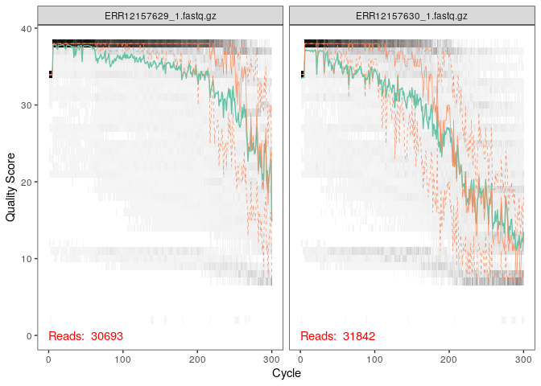
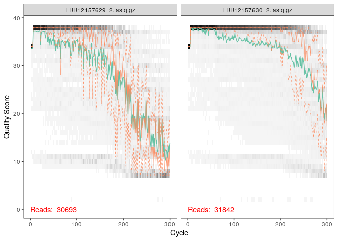

R Notebook
================

``` r
library(dada2); packageVersion("dada2")
```

    ## Loading required package: Rcpp

    ## [1] '1.28.0'

``` r
path <- "~/sow" # CHANGE ME to the directory containing the fastq files after unzipping.
list.files(path)
```

    ##   [1] "dada2sow_files"                                                  
    ##   [2] "dada2sow.md"                                                     
    ##   [3] "dada2sow.nb.html"                                                
    ##   [4] "dada2sow.Rmd"                                                    
    ##   [5] "ena-file-download-read_run-PRJEB67827-fastq_ftp-20260101-1524.sh"
    ##   [6] "env.RData"                                                       
    ##   [7] "ERR12157629_1.fastq.gz"                                          
    ##   [8] "ERR12157629_2.fastq.gz"                                          
    ##   [9] "ERR12157630_1.fastq.gz"                                          
    ##  [10] "ERR12157630_2.fastq.gz"                                          
    ##  [11] "ERR12157631_1.fastq.gz"                                          
    ##  [12] "ERR12157631_2.fastq.gz"                                          
    ##  [13] "ERR12157632_1.fastq.gz"                                          
    ##  [14] "ERR12157632_2.fastq.gz"                                          
    ##  [15] "ERR12157633_1.fastq.gz"                                          
    ##  [16] "ERR12157633_2.fastq.gz"                                          
    ##  [17] "ERR12157634_1.fastq.gz"                                          
    ##  [18] "ERR12157634_2.fastq.gz"                                          
    ##  [19] "ERR12157635_1.fastq.gz"                                          
    ##  [20] "ERR12157635_2.fastq.gz"                                          
    ##  [21] "ERR12157636_1.fastq.gz"                                          
    ##  [22] "ERR12157636_2.fastq.gz"                                          
    ##  [23] "ERR12157637_1.fastq.gz"                                          
    ##  [24] "ERR12157637_2.fastq.gz"                                          
    ##  [25] "ERR12157638_1.fastq.gz"                                          
    ##  [26] "ERR12157638_2.fastq.gz"                                          
    ##  [27] "ERR12157639_1.fastq.gz"                                          
    ##  [28] "ERR12157639_2.fastq.gz"                                          
    ##  [29] "ERR12157640_1.fastq.gz"                                          
    ##  [30] "ERR12157640_2.fastq.gz"                                          
    ##  [31] "ERR14121472_1.fastq.gz"                                          
    ##  [32] "ERR14121472_2.fastq.gz"                                          
    ##  [33] "ERR14121473_1.fastq.gz"                                          
    ##  [34] "ERR14121473_2.fastq.gz"                                          
    ##  [35] "ERR14121474_1.fastq.gz"                                          
    ##  [36] "ERR14121474_2.fastq.gz"                                          
    ##  [37] "ERR14121475_1.fastq.gz"                                          
    ##  [38] "ERR14121475_2.fastq.gz"                                          
    ##  [39] "ERR14121476_1.fastq.gz"                                          
    ##  [40] "ERR14121476_2.fastq.gz"                                          
    ##  [41] "ERR14121477_1.fastq.gz"                                          
    ##  [42] "ERR14121477_2.fastq.gz"                                          
    ##  [43] "ERR14121478_1.fastq.gz"                                          
    ##  [44] "ERR14121478_2.fastq.gz"                                          
    ##  [45] "ERR14121479_1.fastq.gz"                                          
    ##  [46] "ERR14121479_2.fastq.gz"                                          
    ##  [47] "ERR14121480_1.fastq.gz"                                          
    ##  [48] "ERR14121480_2.fastq.gz"                                          
    ##  [49] "ERR14121481_1.fastq.gz"                                          
    ##  [50] "ERR14121481_2.fastq.gz"                                          
    ##  [51] "ERR14121482_1.fastq.gz"                                          
    ##  [52] "ERR14121482_2.fastq.gz"                                          
    ##  [53] "ERR14121483_1.fastq.gz"                                          
    ##  [54] "ERR14121483_2.fastq.gz"                                          
    ##  [55] "ERR14121484_1.fastq.gz"                                          
    ##  [56] "ERR14121484_2.fastq.gz"                                          
    ##  [57] "ERR14121485_1.fastq.gz"                                          
    ##  [58] "ERR14121485_2.fastq.gz"                                          
    ##  [59] "ERR14121486_1.fastq.gz"                                          
    ##  [60] "ERR14121486_2.fastq.gz"                                          
    ##  [61] "ERR14121487_1.fastq.gz"                                          
    ##  [62] "ERR14121487_2.fastq.gz"                                          
    ##  [63] "ERR14121488_1.fastq.gz"                                          
    ##  [64] "ERR14121488_2.fastq.gz"                                          
    ##  [65] "ERR14121489_1.fastq.gz"                                          
    ##  [66] "ERR14121489_2.fastq.gz"                                          
    ##  [67] "ERR14121490_1.fastq.gz"                                          
    ##  [68] "ERR14121490_2.fastq.gz"                                          
    ##  [69] "ERR14121491_1.fastq.gz"                                          
    ##  [70] "ERR14121491_2.fastq.gz"                                          
    ##  [71] "ERR14121492_1.fastq.gz"                                          
    ##  [72] "ERR14121492_2.fastq.gz"                                          
    ##  [73] "ERR14121493_1.fastq.gz"                                          
    ##  [74] "ERR14121493_2.fastq.gz"                                          
    ##  [75] "ERR14121494_1.fastq.gz"                                          
    ##  [76] "ERR14121494_2.fastq.gz"                                          
    ##  [77] "ERR14121495_1.fastq.gz"                                          
    ##  [78] "ERR14121495_2.fastq.gz"                                          
    ##  [79] "ERR14121496_1.fastq.gz"                                          
    ##  [80] "ERR14121496_2.fastq.gz"                                          
    ##  [81] "ERR14121497_1.fastq.gz"                                          
    ##  [82] "ERR14121497_2.fastq.gz"                                          
    ##  [83] "ERR14121498_1.fastq.gz"                                          
    ##  [84] "ERR14121498_2.fastq.gz"                                          
    ##  [85] "ERR14121499_1.fastq.gz"                                          
    ##  [86] "ERR14121499_2.fastq.gz"                                          
    ##  [87] "ERR14121500_1.fastq.gz"                                          
    ##  [88] "ERR14121500_2.fastq.gz"                                          
    ##  [89] "ERR14121501_1.fastq.gz"                                          
    ##  [90] "ERR14121501_2.fastq.gz"                                          
    ##  [91] "ERR14121502_1.fastq.gz"                                          
    ##  [92] "ERR14121502_2.fastq.gz"                                          
    ##  [93] "ERR14121503_1.fastq.gz"                                          
    ##  [94] "ERR14121503_2.fastq.gz"                                          
    ##  [95] "ERR14121504_1.fastq.gz"                                          
    ##  [96] "ERR14121504_2.fastq.gz"                                          
    ##  [97] "ERR14121505_1.fastq.gz"                                          
    ##  [98] "ERR14121505_2.fastq.gz"                                          
    ##  [99] "ERR14121506_1.fastq.gz"                                          
    ## [100] "ERR14121506_2.fastq.gz"                                          
    ## [101] "ERR14121507_1.fastq.gz"                                          
    ## [102] "ERR14121507_2.fastq.gz"                                          
    ## [103] "ERR14121508_1.fastq.gz"                                          
    ## [104] "ERR14121508_2.fastq.gz"                                          
    ## [105] "ERR14121509_1.fastq.gz"                                          
    ## [106] "ERR14121509_2.fastq.gz"                                          
    ## [107] "ERR14121510_1.fastq.gz"                                          
    ## [108] "ERR14121510_2.fastq.gz"                                          
    ## [109] "ERR14121511_1.fastq.gz"                                          
    ## [110] "ERR14121511_2.fastq.gz"                                          
    ## [111] "ERR14121512_1.fastq.gz"                                          
    ## [112] "ERR14121512_2.fastq.gz"                                          
    ## [113] "ERR14121513_1.fastq.gz"                                          
    ## [114] "ERR14121513_2.fastq.gz"                                          
    ## [115] "ERR14121514_1.fastq.gz"                                          
    ## [116] "ERR14121514_2.fastq.gz"                                          
    ## [117] "ERR14121515_1.fastq.gz"                                          
    ## [118] "ERR14121515_2.fastq.gz"                                          
    ## [119] "ERR14121516_1.fastq.gz"                                          
    ## [120] "ERR14121516_2.fastq.gz"                                          
    ## [121] "ERR14121517_1.fastq.gz"                                          
    ## [122] "ERR14121517_2.fastq.gz"                                          
    ## [123] "ERR14121518_1.fastq.gz"                                          
    ## [124] "ERR14121518_2.fastq.gz"                                          
    ## [125] "ERR14121519_1.fastq.gz"                                          
    ## [126] "ERR14121519_2.fastq.gz"                                          
    ## [127] "ERR14121520_1.fastq.gz"                                          
    ## [128] "ERR14121520_2.fastq.gz"                                          
    ## [129] "ERR14121521_1.fastq.gz"                                          
    ## [130] "ERR14121521_2.fastq.gz"                                          
    ## [131] "ERR14121522_1.fastq.gz"                                          
    ## [132] "ERR14121522_2.fastq.gz"                                          
    ## [133] "ERR14121523_1.fastq.gz"                                          
    ## [134] "ERR14121523_2.fastq.gz"                                          
    ## [135] "ERR14121524_1.fastq.gz"                                          
    ## [136] "ERR14121524_2.fastq.gz"                                          
    ## [137] "ERR14121525_1.fastq.gz"                                          
    ## [138] "ERR14121525_2.fastq.gz"                                          
    ## [139] "ERR14121526_1.fastq.gz"                                          
    ## [140] "ERR14121526_2.fastq.gz"                                          
    ## [141] "ERR14121527_1.fastq.gz"                                          
    ## [142] "ERR14121527_2.fastq.gz"                                          
    ## [143] "ERR14121528_1.fastq.gz"                                          
    ## [144] "ERR14121528_2.fastq.gz"                                          
    ## [145] "ERR14121529_1.fastq.gz"                                          
    ## [146] "ERR14121529_2.fastq.gz"                                          
    ## [147] "ERR14121530_1.fastq.gz"                                          
    ## [148] "ERR14121530_2.fastq.gz"                                          
    ## [149] "ERR14121531_1.fastq.gz"                                          
    ## [150] "ERR14121531_2.fastq.gz"                                          
    ## [151] "ERR14121532_1.fastq.gz"                                          
    ## [152] "ERR14121532_2.fastq.gz"                                          
    ## [153] "ERR14121533_1.fastq.gz"                                          
    ## [154] "ERR14121533_2.fastq.gz"                                          
    ## [155] "ERR14121534_1.fastq.gz"                                          
    ## [156] "ERR14121534_2.fastq.gz"                                          
    ## [157] "ERR14121535_1.fastq.gz"                                          
    ## [158] "ERR14121535_2.fastq.gz"                                          
    ## [159] "ERR14121536_1.fastq.gz"                                          
    ## [160] "ERR14121536_2.fastq.gz"                                          
    ## [161] "ERR14121537_1.fastq.gz"                                          
    ## [162] "ERR14121537_2.fastq.gz"                                          
    ## [163] "ERR14121538_1.fastq.gz"                                          
    ## [164] "ERR14121538_2.fastq.gz"                                          
    ## [165] "ERR14121539_1.fastq.gz"                                          
    ## [166] "ERR14121539_2.fastq.gz"                                          
    ## [167] "ERR14121540_1.fastq.gz"                                          
    ## [168] "ERR14121540_2.fastq.gz"                                          
    ## [169] "ERR14121541_1.fastq.gz"                                          
    ## [170] "ERR14121541_2.fastq.gz"                                          
    ## [171] "ERR14121542_1.fastq.gz"                                          
    ## [172] "ERR14121542_2.fastq.gz"                                          
    ## [173] "ERR14121543_1.fastq.gz"                                          
    ## [174] "ERR14121543_2.fastq.gz"                                          
    ## [175] "ERR14121544_1.fastq.gz"                                          
    ## [176] "ERR14121544_2.fastq.gz"                                          
    ## [177] "ERR14121545_1.fastq.gz"                                          
    ## [178] "ERR14121545_2.fastq.gz"                                          
    ## [179] "ERR14121546_1.fastq.gz"                                          
    ## [180] "ERR14121546_2.fastq.gz"                                          
    ## [181] "ERR14121547_1.fastq.gz"                                          
    ## [182] "ERR14121547_2.fastq.gz"                                          
    ## [183] "ERR14121548_1.fastq.gz"                                          
    ## [184] "ERR14121548_2.fastq.gz"                                          
    ## [185] "ERR14121549_1.fastq.gz"                                          
    ## [186] "ERR14121549_2.fastq.gz"                                          
    ## [187] "ERR14121550_1.fastq.gz"                                          
    ## [188] "ERR14121550_2.fastq.gz"                                          
    ## [189] "ERR14121551_1.fastq.gz"                                          
    ## [190] "ERR14121551_2.fastq.gz"                                          
    ## [191] "ERR14121552_1.fastq.gz"                                          
    ## [192] "ERR14121552_2.fastq.gz"                                          
    ## [193] "ERR14121553_1.fastq.gz"                                          
    ## [194] "ERR14121553_2.fastq.gz"

``` r
# Forward and reverse fastq filenames have format: SAMPLENAME_1.fastq and SAMPLENAME_2.fastq
fnFs <- sort(list.files(path, pattern="_1.fastq", full.names = TRUE))
fnRs <- sort(list.files(path, pattern="_2.fastq", full.names = TRUE))
# Extract sample names, assuming filenames have format: SAMPLENAME_XXX.fastq
sample.names <- sapply(strsplit(basename(fnFs), "_"), `[`, 1)
```

``` r
plotQualityProfile(fnFs[1:2])
```

<!-- -->

``` r
plotQualityProfile(fnRs[1:2])
```

<!-- -->
