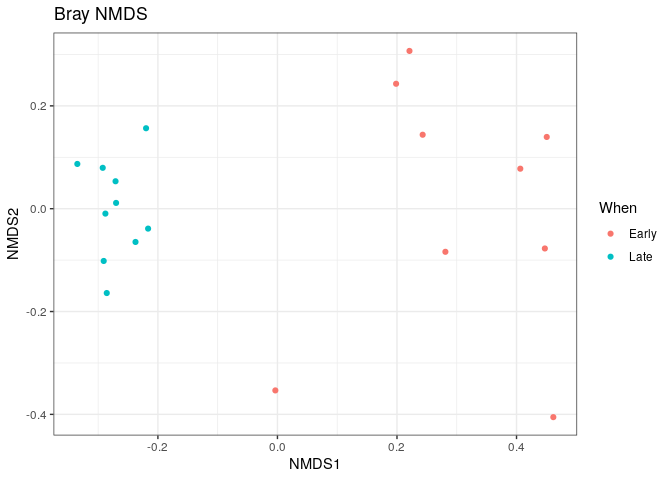

R Notebook
================

Chargement du package dada2 \# Ce package est utilisé pour l’analyse de
séquences d’ADN issues du séquençage haut débit (NGS), \#dans ce
tutoriel ce pour les gène 16S \# Il permet de filtrer, corriger,
assembler et classifier les séquences afin d’obtenir des ASVs. \#
Chargement du package dada2

``` r
library(dada2)
```

    ## Loading required package: Rcpp

# Vérification de la version du package dada2 installée

packageVersion(“dada2”)

``` r
library(dada2); packageVersion("dada2")
```

    ## [1] '1.28.0'

# Définition du chemin où se trouvent mes fichiers fastq (les données brutes de séquençage Illumina)

# Ici, le chemin est “~/MiSeq_SOP” :

# - “~” correspond à mon répertoire utilisateur (home directory).

# - “MiSeq_SOP” est le dossier qui contient mes fichiers .fastq après décompression.

``` r
setwd("/home/rstudio/tuturiol_sow")
path <- "~/MiSeq_SOP" # CHANGE ME to the directory containing the fastq files after unzipping.
list.files(path)
```

    ##  [1] "F3D0_S188_L001_R1_001.fastq"   "F3D0_S188_L001_R2_001.fastq"  
    ##  [3] "F3D1_S189_L001_R1_001.fastq"   "F3D1_S189_L001_R2_001.fastq"  
    ##  [5] "F3D141_S207_L001_R1_001.fastq" "F3D141_S207_L001_R2_001.fastq"
    ##  [7] "F3D142_S208_L001_R1_001.fastq" "F3D142_S208_L001_R2_001.fastq"
    ##  [9] "F3D143_S209_L001_R1_001.fastq" "F3D143_S209_L001_R2_001.fastq"
    ## [11] "F3D144_S210_L001_R1_001.fastq" "F3D144_S210_L001_R2_001.fastq"
    ## [13] "F3D145_S211_L001_R1_001.fastq" "F3D145_S211_L001_R2_001.fastq"
    ## [15] "F3D146_S212_L001_R1_001.fastq" "F3D146_S212_L001_R2_001.fastq"
    ## [17] "F3D147_S213_L001_R1_001.fastq" "F3D147_S213_L001_R2_001.fastq"
    ## [19] "F3D148_S214_L001_R1_001.fastq" "F3D148_S214_L001_R2_001.fastq"
    ## [21] "F3D149_S215_L001_R1_001.fastq" "F3D149_S215_L001_R2_001.fastq"
    ## [23] "F3D150_S216_L001_R1_001.fastq" "F3D150_S216_L001_R2_001.fastq"
    ## [25] "F3D2_S190_L001_R1_001.fastq"   "F3D2_S190_L001_R2_001.fastq"  
    ## [27] "F3D3_S191_L001_R1_001.fastq"   "F3D3_S191_L001_R2_001.fastq"  
    ## [29] "F3D5_S193_L001_R1_001.fastq"   "F3D5_S193_L001_R2_001.fastq"  
    ## [31] "F3D6_S194_L001_R1_001.fastq"   "F3D6_S194_L001_R2_001.fastq"  
    ## [33] "F3D7_S195_L001_R1_001.fastq"   "F3D7_S195_L001_R2_001.fastq"  
    ## [35] "F3D8_S196_L001_R1_001.fastq"   "F3D8_S196_L001_R2_001.fastq"  
    ## [37] "F3D9_S197_L001_R1_001.fastq"   "F3D9_S197_L001_R2_001.fastq"  
    ## [39] "filtered"                      "HMP_MOCK.v35.fasta"           
    ## [41] "Mock_S280_L001_R1_001.fastq"   "Mock_S280_L001_R2_001.fastq"  
    ## [43] "mouse.dpw.metadata"            "mouse.time.design"            
    ## [45] "stability.batch"               "stability.files"

# Les fichiers FASTQ forward et reverse suivent un format de nommage standard :

# Exemple : SAMPLENAME_R1_001.fastq et SAMPLENAME_R2_001.fastq

# - R1 = lectures forward (lecture avant)

# - R2 = lectures reverse (lecture arrière)

# - “SAMPLENAME” = identifiant de ton échantillon

# On crée une liste des fichiers forward (R1)

fnFs \<- sort(list.files(path, pattern=“\_R1_001.fastq”, full.names =
TRUE))

# On crée une liste des fichiers reverse (R2)

fnRs \<- sort(list.files(path, pattern=“\_R2_001.fastq”, full.names =
TRUE))

# Extraction des noms d’échantillons

# basename(fnFs) → garde seulement le nom du fichier (pas le chemin complet)

# strsplit(…, “*”) → découpe le nom du fichier en morceaux séparés par ”*”

# sapply(…, `[`, 1) → prend le 1er morceau (donc le nom de l’échantillon avant le “\_“)

sample.names \<- sapply(strsplit(basename(fnFs), “\_“), `[`, 1)

``` r
# Forward and reverse fastq filenames have format: SAMPLENAME_R1_001.fastq and SAMPLENAME_R2_001.fastq
fnFs <- sort(list.files(path, pattern="_R1_001.fastq", full.names = TRUE))
fnRs <- sort(list.files(path, pattern="_R2_001.fastq", full.names = TRUE))
# Extract sample names, assuming filenames have format: SAMPLENAME_XXX.fastq
sample.names <- sapply(strsplit(basename(fnFs), "_"), `[`, 1)
```

# Affichage des profils de qualité pour les 2 premiers fichiers forward

``` r
plotQualityProfile(fnFs[1:2])
```

<!-- -->

# Affichage des profils de qualité pour les 2 premiers fichiers reverse

``` r
plotQualityProfile(fnRs[1:2])
```

<!-- --> \#
Création des chemins de sortie pour les fichiers filtrés (lectures
forward) \# On utilise file.path() pour faire un chemin complet : \# -
“path” = dossier principal (~/MiSeq_SOP) \# - “filtered” = sous-dossier
où seront stockés les fichiers filtrés \# - paste0() le nom de
l’échantillon avec le suffixe “\_F_filt.fastq.gz” \# meme chose pour les
lectures reverse (R2), suffixe “\_R_filt.fastq.gz” \# On associe chaque
fichier forward filtré à son nom d’échantillon names(filtFs) \<-
sample.names \# Idem pour les fichiers reverse filtrés names(filtRs) \<-
sample.names

``` r
# Place filtered files in filtered/ subdirectory
filtFs <- file.path(path, "filtered", paste0(sample.names, "_F_filt.fastq.gz"))
filtRs <- file.path(path, "filtered", paste0(sample.names, "_R_filt.fastq.gz"))
names(filtFs) <- sample.names
names(filtRs) <- sample.names
```

# Filtrage et tronquage des lectures forward et reverse

out \<- filterAndTrim( \#fnFs,fichiers FASTQ forward d’origine
\#filtFs,chemins de sortie pour forward filtrés \#fnRs, fichiers FASTQ
reverse d’origine \# filtRs, chemins de sortie pour reverse filtrés \#
truncLen = c(240,160), Longueurs de tronquage : 240 bases pour R1, 160
pour R2 \# maxN = 0, Aucun N autorisé (bases indéterminées) \#maxEE =
c(2,2),Maximum attendu d’erreurs : 2 pour forward, 2 pour reverse
\#truncQ = 2, Tronquer à partir d’une base \< Q2 (très basse qualité)
\#rm.phix = TRUE,Supprime les lectures correspondant au contrôle PhiX
\#compress = TRUE, Fichiers de sortie compressés en .gz \#multithread =
F, Sur Windows mettre FALSE, sur Linux/Mac on peut mettre TRUE

``` r
out <- filterAndTrim(fnFs, filtFs, fnRs, filtRs, truncLen=c(240,160),
              maxN=0, maxEE=c(2,2), truncQ=2, rm.phix=TRUE,
              compress=TRUE, multithread=F) # On Windows set multithread=FALSE
head(out)
```

    ##                               reads.in reads.out
    ## F3D0_S188_L001_R1_001.fastq       7793      7113
    ## F3D1_S189_L001_R1_001.fastq       5869      5299
    ## F3D141_S207_L001_R1_001.fastq     5958      5463
    ## F3D142_S208_L001_R1_001.fastq     3183      2914
    ## F3D143_S209_L001_R1_001.fastq     3178      2941
    ## F3D144_S210_L001_R1_001.fastq     4827      4312

# Apprentissage du modèle d’erreur sur les lectures forward filtrées

``` r
errF <- learnErrors(filtFs, multithread=TRUE)
```

    ## 33514080 total bases in 139642 reads from 20 samples will be used for learning the error rates.

# Apprentissage du profil d’erreurs pour les reads reverse filtrés

``` r
errR <- learnErrors(filtRs, multithread=TRUE)
```

    ## 22342720 total bases in 139642 reads from 20 samples will be used for learning the error rates.

# Affichage du modèle d’erreurs pour les reads forward

``` r
plotErrors(errF, nominalQ=TRUE)
```

    ## Warning: Transformation introduced infinite values in continuous y-axis
    ## Transformation introduced infinite values in continuous y-axis

<!-- -->

# Inférence des variants de séquences exactes (ASVs) sur les fichiers forward

\#Cela te dit combien de lectures ont été conservées et combien de
variants uniques (ASVs) ont été trouvés

``` r
dadaFs <- dada(filtFs, err=errF, multithread=TRUE)
```

    ## Sample 1 - 7113 reads in 1979 unique sequences.
    ## Sample 2 - 5299 reads in 1639 unique sequences.
    ## Sample 3 - 5463 reads in 1477 unique sequences.
    ## Sample 4 - 2914 reads in 904 unique sequences.
    ## Sample 5 - 2941 reads in 939 unique sequences.
    ## Sample 6 - 4312 reads in 1267 unique sequences.
    ## Sample 7 - 6741 reads in 1756 unique sequences.
    ## Sample 8 - 4560 reads in 1438 unique sequences.
    ## Sample 9 - 15637 reads in 3590 unique sequences.
    ## Sample 10 - 11413 reads in 2762 unique sequences.
    ## Sample 11 - 12017 reads in 3021 unique sequences.
    ## Sample 12 - 5032 reads in 1566 unique sequences.
    ## Sample 13 - 18075 reads in 3707 unique sequences.
    ## Sample 14 - 6250 reads in 1479 unique sequences.
    ## Sample 15 - 4052 reads in 1195 unique sequences.
    ## Sample 16 - 7369 reads in 1832 unique sequences.
    ## Sample 17 - 4765 reads in 1183 unique sequences.
    ## Sample 18 - 4871 reads in 1382 unique sequences.
    ## Sample 19 - 6504 reads in 1709 unique sequences.
    ## Sample 20 - 4314 reads in 897 unique sequences.

# Inférence des variants de séquences exactes (ASVs) sur les fichiers reverse

\#Cela te dit combien de lectures ont été conservées et combien de
variants uniques (ASVs) ont été trouvés

``` r
dadaRs <- dada(filtRs, err=errR, multithread=TRUE)
```

    ## Sample 1 - 7113 reads in 1660 unique sequences.
    ## Sample 2 - 5299 reads in 1349 unique sequences.
    ## Sample 3 - 5463 reads in 1335 unique sequences.
    ## Sample 4 - 2914 reads in 853 unique sequences.
    ## Sample 5 - 2941 reads in 880 unique sequences.
    ## Sample 6 - 4312 reads in 1286 unique sequences.
    ## Sample 7 - 6741 reads in 1803 unique sequences.
    ## Sample 8 - 4560 reads in 1265 unique sequences.
    ## Sample 9 - 15637 reads in 3414 unique sequences.
    ## Sample 10 - 11413 reads in 2522 unique sequences.
    ## Sample 11 - 12017 reads in 2771 unique sequences.
    ## Sample 12 - 5032 reads in 1415 unique sequences.
    ## Sample 13 - 18075 reads in 3290 unique sequences.
    ## Sample 14 - 6250 reads in 1390 unique sequences.
    ## Sample 15 - 4052 reads in 1134 unique sequences.
    ## Sample 16 - 7369 reads in 1635 unique sequences.
    ## Sample 17 - 4765 reads in 1084 unique sequences.
    ## Sample 18 - 4871 reads in 1161 unique sequences.
    ## Sample 19 - 6504 reads in 1502 unique sequences.
    ## Sample 20 - 4314 reads in 732 unique sequences.

\#Utiles pour un aperçu global nombre d’uniques (ASVs “bruts”) par
échantillon

``` r
dadaFs[[1]]
```

    ## dada-class: object describing DADA2 denoising results
    ## 128 sequence variants were inferred from 1979 input unique sequences.
    ## Key parameters: OMEGA_A = 1e-40, OMEGA_C = 1e-40, BAND_SIZE = 16

# Fusion des lectures forward et reverse (R1 et R2)

\#Affiche les premières lignes du tableau de résultats pour le 1er
échantillon

``` r
mergers <- mergePairs(dadaFs, filtFs, dadaRs, filtRs, verbose=TRUE)
```

    ## 6540 paired-reads (in 107 unique pairings) successfully merged out of 6891 (in 197 pairings) input.

    ## 5028 paired-reads (in 101 unique pairings) successfully merged out of 5190 (in 157 pairings) input.

    ## 4986 paired-reads (in 81 unique pairings) successfully merged out of 5267 (in 166 pairings) input.

    ## 2595 paired-reads (in 52 unique pairings) successfully merged out of 2754 (in 108 pairings) input.

    ## 2553 paired-reads (in 60 unique pairings) successfully merged out of 2785 (in 119 pairings) input.

    ## 3646 paired-reads (in 55 unique pairings) successfully merged out of 4109 (in 157 pairings) input.

    ## 6079 paired-reads (in 81 unique pairings) successfully merged out of 6514 (in 198 pairings) input.

    ## 3968 paired-reads (in 91 unique pairings) successfully merged out of 4388 (in 187 pairings) input.

    ## 14233 paired-reads (in 143 unique pairings) successfully merged out of 15355 (in 352 pairings) input.

    ## 10528 paired-reads (in 120 unique pairings) successfully merged out of 11165 (in 278 pairings) input.

    ## 11154 paired-reads (in 137 unique pairings) successfully merged out of 11797 (in 298 pairings) input.

    ## 4349 paired-reads (in 85 unique pairings) successfully merged out of 4802 (in 179 pairings) input.

    ## 17431 paired-reads (in 153 unique pairings) successfully merged out of 17812 (in 272 pairings) input.

    ## 5850 paired-reads (in 81 unique pairings) successfully merged out of 6095 (in 159 pairings) input.

    ## 3716 paired-reads (in 86 unique pairings) successfully merged out of 3894 (in 147 pairings) input.

    ## 6865 paired-reads (in 99 unique pairings) successfully merged out of 7191 (in 187 pairings) input.

    ## 4426 paired-reads (in 67 unique pairings) successfully merged out of 4603 (in 127 pairings) input.

    ## 4576 paired-reads (in 101 unique pairings) successfully merged out of 4739 (in 174 pairings) input.

    ## 6092 paired-reads (in 109 unique pairings) successfully merged out of 6315 (in 173 pairings) input.

    ## 4269 paired-reads (in 20 unique pairings) successfully merged out of 4281 (in 28 pairings) input.

``` r
# Inspect the merger data.frame from the first sample
head(mergers[[1]])
```

    ##                                                                                                                                                                                                                                                       sequence
    ## 1 TACGGAGGATGCGAGCGTTATCCGGATTTATTGGGTTTAAAGGGTGCGCAGGCGGAAGATCAAGTCAGCGGTAAAATTGAGAGGCTCAACCTCTTCGAGCCGTTGAAACTGGTTTTCTTGAGTGAGCGAGAAGTATGCGGAATGCGTGGTGTAGCGGTGAAATGCATAGATATCACGCAGAACTCCGATTGCGAAGGCAGCATACCGGCGCTCAACTGACGCTCATGCACGAAAGTGTGGGTATCGAACAGG
    ## 2 TACGGAGGATGCGAGCGTTATCCGGATTTATTGGGTTTAAAGGGTGCGTAGGCGGCCTGCCAAGTCAGCGGTAAAATTGCGGGGCTCAACCCCGTACAGCCGTTGAAACTGCCGGGCTCGAGTGGGCGAGAAGTATGCGGAATGCGTGGTGTAGCGGTGAAATGCATAGATATCACGCAGAACCCCGATTGCGAAGGCAGCATACCGGCGCCCTACTGACGCTGAGGCACGAAAGTGCGGGGATCAAACAGG
    ## 3 TACGGAGGATGCGAGCGTTATCCGGATTTATTGGGTTTAAAGGGTGCGTAGGCGGGCTGTTAAGTCAGCGGTCAAATGTCGGGGCTCAACCCCGGCCTGCCGTTGAAACTGGCGGCCTCGAGTGGGCGAGAAGTATGCGGAATGCGTGGTGTAGCGGTGAAATGCATAGATATCACGCAGAACTCCGATTGCGAAGGCAGCATACCGGCGCCCGACTGACGCTGAGGCACGAAAGCGTGGGTATCGAACAGG
    ## 4 TACGGAGGATGCGAGCGTTATCCGGATTTATTGGGTTTAAAGGGTGCGTAGGCGGGCTTTTAAGTCAGCGGTAAAAATTCGGGGCTCAACCCCGTCCGGCCGTTGAAACTGGGGGCCTTGAGTGGGCGAGAAGAAGGCGGAATGCGTGGTGTAGCGGTGAAATGCATAGATATCACGCAGAACCCCGATTGCGAAGGCAGCCTTCCGGCGCCCTACTGACGCTGAGGCACGAAAGTGCGGGGATCGAACAGG
    ## 5 TACGGAGGATGCGAGCGTTATCCGGATTTATTGGGTTTAAAGGGTGCGCAGGCGGACTCTCAAGTCAGCGGTCAAATCGCGGGGCTCAACCCCGTTCCGCCGTTGAAACTGGGAGCCTTGAGTGCGCGAGAAGTAGGCGGAATGCGTGGTGTAGCGGTGAAATGCATAGATATCACGCAGAACTCCGATTGCGAAGGCAGCCTACCGGCGCGCAACTGACGCTCATGCACGAAAGCGTGGGTATCGAACAGG
    ## 6 TACGGAGGATGCGAGCGTTATCCGGATTTATTGGGTTTAAAGGGTGCGTAGGCGGGATGCCAAGTCAGCGGTAAAAAAGCGGTGCTCAACGCCGTCGAGCCGTTGAAACTGGCGTTCTTGAGTGGGCGAGAAGTATGCGGAATGCGTGGTGTAGCGGTGAAATGCATAGATATCACGCAGAACTCCGATTGCGAAGGCAGCATACCGGCGCCCTACTGACGCTGAGGCACGAAAGCGTGGGTATCGAACAGG
    ##   abundance forward reverse nmatch nmismatch nindel prefer accept
    ## 1       579       1       1    148         0      0      1   TRUE
    ## 2       470       2       2    148         0      0      2   TRUE
    ## 3       449       3       4    148         0      0      1   TRUE
    ## 4       430       4       3    148         0      0      2   TRUE
    ## 5       345       5       6    148         0      0      1   TRUE
    ## 6       282       6       5    148         0      0      2   TRUE

# Construction de la table de séquences (ASV table)

# Dimensions de la table (nb d’échantillons x nb d’ASVs)

\#Prend en entrée les résultats de mergePairs() (séquences fusionnées
par échantillon)

``` r
seqtab <- makeSequenceTable(mergers)
dim(seqtab)
```

    ## [1]  20 293

# Vérification de la distribution des longueurs des séquences (ASVs)

\#construit une table de fréquence indiquant combien d’ASVs ont telle ou
telle longueur.

``` r
# Inspect distribution of sequence lengths
table(nchar(getSequences(seqtab)))
```

    ## 
    ## 251 252 253 254 255 
    ##   1  88 196   6   2

# Suppression des séquences chimériques

# Dimensions de la nouvelle table (après suppression des chimères)

\#Détecte les chimères = artefacts créés lors de la PCR, où deux
séquences différentes s’assemblent faussement \#C’est une étape
indispensable, car les chimères peuvent représenter jusqu’à 20–30 % des
séquences dans un jeu 16S \#Resultat, Table d’ASVs nettoyée : seules les
séquences biologiquement plausibles restent

``` r
seqtab.nochim <- removeBimeraDenovo(seqtab, method="consensus", multithread=TRUE, verbose=TRUE)
```

    ## Identified 61 bimeras out of 293 input sequences.

``` r
dim(seqtab.nochim)
```

    ## [1]  20 232

# Calcul de la proportion de lectures non chimériques

\#omme de toutes les lectures dans ta table avant suppression des
chimères. \#donne donc la fraction de lectures conservées.

``` r
sum(seqtab.nochim)/sum(seqtab)
```

    ## [1] 0.9640374

# Fonction utilitaire : compte le nombre total de lectures uniques

# Construction du tableau de suivi

# Attribution des noms de colonnes

# Attribution des noms de lignes (noms d’échantillons)

# Affiche les 6 premières lignes du tableau

\#Ça permet de visualiser les pertes à chaque étape (filtrage,
débruitage, fusion, anti-chimères). \#On peut rapidement repérer un
problème (ex : très faible taux de fusion ou énorme perte après
suppression des chimères).

``` r
getN <- function(x) sum(getUniques(x))
track <- cbind(out, sapply(dadaFs, getN), sapply(dadaRs, getN), sapply(mergers, getN), rowSums(seqtab.nochim))
# If processing a single sample, remove the sapply calls: e.g. replace sapply(dadaFs, getN) with getN(dadaFs)
colnames(track) <- c("input", "filtered", "denoisedF", "denoisedR", "merged", "nonchim")
rownames(track) <- sample.names
head(track)
```

    ##        input filtered denoisedF denoisedR merged nonchim
    ## F3D0    7793     7113      6976      6979   6540    6528
    ## F3D1    5869     5299      5227      5239   5028    5017
    ## F3D141  5958     5463      5331      5357   4986    4863
    ## F3D142  3183     2914      2799      2830   2595    2521
    ## F3D143  3178     2941      2822      2868   2553    2519
    ## F3D144  4827     4312      4151      4228   3646    3507

\#Création d’un dossier “tax” dans ton répertoire utilisateur (home
directory) \# C’est ici que j’ai stocké les fichiers de référence
nécessaires à l’assignation taxonomique \# Téléchargement du jeu
d’entraînement Silva v132 (classification des taxons jusqu’au genre) \#
Téléchargement du fichier d’assignation au niveau espèce (Silva v132)

``` r
dir.create("~/tax", showWarnings=FALSE)
download.file("https://zenodo.org/record/1172783/files/silva_nr_v132_train_set.fa.gz",
              destfile = "~/tax/silva_nr_v132_train_set.fa.gz",mode = "wb")
download.file("https://zenodo.org/records/1172783/files/silva_species_assignment_v132.fa.gz",
              destfile = "~/tax/files/silva_species_assignment_v132.fa.gz",mode = "wb")
```

    ## Warning in
    ## download.file("https://zenodo.org/records/1172783/files/silva_species_assignment_v132.fa.gz",
    ## : URL
    ## https://zenodo.org/records/1172783/files/silva_species_assignment_v132.fa.gz:
    ## cannot open destfile '~/tax/files/silva_species_assignment_v132.fa.gz', reason
    ## 'No such file or directory'

    ## Warning in
    ## download.file("https://zenodo.org/records/1172783/files/silva_species_assignment_v132.fa.gz",
    ## : download had nonzero exit status

# Assignation taxonomique des ASVs avec la base de référence SILVA v132

``` r
taxa <- assignTaxonomy(seqtab.nochim, "~/tax/silva_nr_v132_train_set.fa.gz", multithread=TRUE)
```

# Ajout de l’assignation au niveau espèce à la matrice taxonomique

\#Ici je lui donnes le fichier silva_species_assignment_v132.fa.gz qui
contient des séquences de référence au niveau espèce.

``` r
taxa <- addSpecies(taxa, "~/silva_species_assignment_v132.fa.gz")
```

# Copie de l’objet taxa pour l’affichage

# Suppression des noms de lignes (qui sont par défaut les séquences ASV)

# cette commande m’a permis d’afficher un aperçu lisible de ta taxonomie sans les séquences en guise de noms.

``` r
taxa.print <- taxa # Removing sequence rownames for display only
rownames(taxa.print) <- NULL
head(taxa.print)
```

    ##      Kingdom    Phylum          Class         Order           Family          
    ## [1,] "Bacteria" "Bacteroidetes" "Bacteroidia" "Bacteroidales" "Muribaculaceae"
    ## [2,] "Bacteria" "Bacteroidetes" "Bacteroidia" "Bacteroidales" "Muribaculaceae"
    ## [3,] "Bacteria" "Bacteroidetes" "Bacteroidia" "Bacteroidales" "Muribaculaceae"
    ## [4,] "Bacteria" "Bacteroidetes" "Bacteroidia" "Bacteroidales" "Muribaculaceae"
    ## [5,] "Bacteria" "Bacteroidetes" "Bacteroidia" "Bacteroidales" "Bacteroidaceae"
    ## [6,] "Bacteria" "Bacteroidetes" "Bacteroidia" "Bacteroidales" "Muribaculaceae"
    ##      Genus         Species
    ## [1,] NA            NA     
    ## [2,] NA            NA     
    ## [3,] NA            NA     
    ## [4,] NA            NA     
    ## [5,] "Bacteroides" NA     
    ## [6,] NA            NA

# Chargement du package DECIPHE

# Vérification de la version installée

packageVersion(“DECIPHER”) \#Charge le package DECIPHER, développé pour
l’analyse de séquences d’ADN/ARN

``` r
library(DECIPHER); packageVersion("DECIPHER")
```

    ## Loading required package: Biostrings

    ## Loading required package: BiocGenerics

    ## 
    ## Attaching package: 'BiocGenerics'

    ## The following objects are masked from 'package:stats':
    ## 
    ##     IQR, mad, sd, var, xtabs

    ## The following objects are masked from 'package:base':
    ## 
    ##     anyDuplicated, aperm, append, as.data.frame, basename, cbind,
    ##     colnames, dirname, do.call, duplicated, eval, evalq, Filter, Find,
    ##     get, grep, grepl, intersect, is.unsorted, lapply, Map, mapply,
    ##     match, mget, order, paste, pmax, pmax.int, pmin, pmin.int,
    ##     Position, rank, rbind, Reduce, rownames, sapply, setdiff, sort,
    ##     table, tapply, union, unique, unsplit, which.max, which.min

    ## Loading required package: S4Vectors

    ## Loading required package: stats4

    ## 
    ## Attaching package: 'S4Vectors'

    ## The following object is masked from 'package:utils':
    ## 
    ##     findMatches

    ## The following objects are masked from 'package:base':
    ## 
    ##     expand.grid, I, unname

    ## Loading required package: IRanges

    ## Loading required package: XVector

    ## Loading required package: GenomeInfoDb

    ## 
    ## Attaching package: 'Biostrings'

    ## The following object is masked from 'package:base':
    ## 
    ##     strsplit

    ## Loading required package: RSQLite

    ## Loading required package: parallel

    ## [1] '2.28.0'

# Crée un objet de séquences ADN à partir des ASVs (colonnes de seqtab.nochim)

# Charge le jeu d’entraînement DECIPHER (SILVA) depuis un fichier .RData local

# Définition des rangs taxonomiques qui t’intéressent

ranks \<- c(“domain”, “phylum”, “class”, “order”, “family”, “genus”,
“species”) \# Convertit la liste d’objets ‘Taxa’ (renvoyée par IdTaxa)
en matrice \# Nomme les colonnes par les rangs et les lignes par les
séquences ASV (nucleotidiques)

``` r
dna <- DNAStringSet(getSequences(seqtab.nochim)) # Create a DNAStringSet from the ASVs
  load("~/SILVA_SSU_r138_2_2024.RData") # CHANGE TO THE PATH OF YOUR TRAINING SET
ids <- IdTaxa(dna, trainingSet, strand="top", processors=NULL, verbose=TRUE) # use all processors
```

    ## ================================================================================
    ## 
    ## Time difference of 147.23 secs

``` r
ranks <- c("domain", "phylum", "class", "order", "family", "genus", "species") # ranks of interest
# Convert the output object of class "Taxa" to a matrix analogous to the output from assignTaxonomy
taxid <- t(sapply(ids, function(x) {
        m <- match(ranks, x$rank)
        taxa <- x$taxon[m]
        taxa[startsWith(taxa, "unclassified_")] <- NA
        taxa
}))
colnames(taxid) <- ranks; rownames(taxid) <- getSequences(seqtab.nochim)
```

# Sélection des ASVs présents dans l’échantillon “Mock”

# On garde uniquement les ASVs avec une abondance \> 0

# puis on les trie par abondance décroissante

# Affiche combien d’ASVs DADA2 a inféré dans le Mock community

\#Dans un Mock community, on connaît le nombre d’espèces (ex. 20 dans
mon cas).

``` r
unqs.mock <- seqtab.nochim["Mock",]
unqs.mock <- sort(unqs.mock[unqs.mock>0], decreasing=TRUE) # Drop ASVs absent in the Mock
cat("DADA2 inferred", length(unqs.mock), "sample sequences present in the Mock community.\n")
```

    ## DADA2 inferred 20 sample sequences present in the Mock community.

# Charge les séquences de référence attendues pour le Mock community

# Le fichier “HMP_MOCK.v35.fasta” contient les séquences 16S des espèces connues

# Vérifie si chaque ASV trouvé dans le Mock correspond à une séquence de référence attendue

# Affiche combien d’ASVs correspondent exactement aux séquences de référence

\#Ça permet de vérifier la précision de DADA2

``` r
mock.ref <- getSequences(file.path(path, "HMP_MOCK.v35.fasta"))
match.ref <- sum(sapply(names(unqs.mock), function(x) any(grepl(x, mock.ref))))
cat("Of those,", sum(match.ref), "were exact matches to the expected reference sequences.\n")
```

    ## Of those, 20 were exact matches to the expected reference sequences.

# Chargement du package phyloseq

# Vérification de la version installée

\#Il est conçu pour faciliter l’intégration, la manipulation et la
visualisation de données issues de pipelines comme DADA2

``` r
library(phyloseq); packageVersion("phyloseq")
```

    ## 
    ## Attaching package: 'phyloseq'

    ## The following object is masked from 'package:IRanges':
    ## 
    ##     distance

    ## [1] '1.44.0'

# Chargement du package Biostrings

# Vérification de la version installée

\#charge le package Biostrings, qui fournit des classes et fonctions
pour manipuler efficacement des séquences biologiques (ADN, ARN,
protéines).

``` r
library(Biostrings); packageVersion("Biostrings")
```

    ## [1] '2.68.1'

# Chargement du package ggplot2

# Vérification de la version installée

\#charge le package ggplot2, qui fait partie du tidyverse et permet de
créer des graphiques élégants et personnalisés.

``` r
library(ggplot2); packageVersion("ggplot2")
```

    ## [1] '3.4.3'

# Définit le thème par défaut pour tous les graphiques ggplot2

\#permet de changer le thème global appliqué à tous tes graphiques
ggplot2

``` r
theme_set(theme_bw())
```

# Récupère les noms des échantillons (correspondent aux lignes de la table ASV)

# Sépare le nom de l’échantillon sur le “D” et prend la première partie (= sujet/identifiant)

# Le premier caractère du “subject” = le genre (M = male, F = female)

# Le reste du “subject” (après le 1er caractère) = identifiant du sujet

# Deuxième partie après “D” = numéro du jour (converti en entier)

# Création d’un data.frame avec les colonnes Sujet, Genre et Jour

# Ajout d’une variable “When” = précoce (Day ≤ 100) ou tardif (Day \> 100)

# Les noms des lignes du data.frame sont les noms des échantillons

\#ça m’a permi de créer une table de métadonnées par échantillon
(sujets, genre, jour, période)

``` r
samples.out <- rownames(seqtab.nochim)
subject <- sapply(strsplit(samples.out, "D"), `[`, 1)
gender <- substr(subject,1,1)
subject <- substr(subject,2,999)
day <- as.integer(sapply(strsplit(samples.out, "D"), `[`, 2))
samdf <- data.frame(Subject=subject, Gender=gender, Day=day)
samdf$When <- "Early"
samdf$When[samdf$Day>100] <- "Late"
rownames(samdf) <- samples.out
```

# Création de l’objet phyloseq avec :

# - table d’abondances des ASVs

# - métadonnées des échantillons

# - taxonomie

# je retire l’échantillon “Mock” qui servait de témoin

``` r
ps <- phyloseq(otu_table(seqtab.nochim, taxa_are_rows=FALSE), 
               sample_data(samdf), 
               tax_table(taxa))
ps <- prune_samples(sample_names(ps) != "Mock", ps) # Remove mock sample
```

# Crée un objet DNAStringSet avec les séquences des ASVs

# Donne comme noms aux séquences leurs noms actuels (longues séquences nucléotidiques)

# Ajoute ces séquences à l’objet phyloseq (fusionne tables + séquences)

# Renomme les ASVs avec des IDs courts et lisibles (ASV1, ASV2, …)

# Affiche l’objet phyloseq (résumé de sa structure : nb échantillons, ASVs, taxons…)

\#Les séquences brutes sont trop longues pour servir de noms → peu
lisibles dans les graphiques ou les tableaux. \#En les renommant ASV1,
ASV2, … je simplifi l’affichage, tout en conservant les séquences dans
l’objet si besoin pour alignement ou phylogénie.

``` r
dna <- Biostrings::DNAStringSet(taxa_names(ps))
names(dna) <- taxa_names(ps)
ps <- merge_phyloseq(ps, dna)
taxa_names(ps) <- paste0("ASV", seq(ntaxa(ps)))
ps
```

    ## phyloseq-class experiment-level object
    ## otu_table()   OTU Table:         [ 232 taxa and 19 samples ]
    ## sample_data() Sample Data:       [ 19 samples by 4 sample variables ]
    ## tax_table()   Taxonomy Table:    [ 232 taxa by 7 taxonomic ranks ]
    ## refseq()      DNAStringSet:      [ 232 reference sequences ]

# Trace la diversité alpha en fonction du jour d’échantillonnage

\#ps, objet phyloseq \#x = “Day”variable en abscisse = jour \#measures =
c(“Shannon”,“Simpson”), \#indices de diversité alpha calculés \#ce
graphique me montre comment la diversité microbienne évolue avec le
temps (Day) et selon la période définie (When = Early vs Late).

``` r
plot_richness(ps, x="Day", measures=c("Shannon", "Simpson"), color="When")
```

    ## Warning in estimate_richness(physeq, split = TRUE, measures = measures): The data you have provided does not have
    ## any singletons. This is highly suspicious. Results of richness
    ## estimates (for example) are probably unreliable, or wrong, if you have already
    ## trimmed low-abundance taxa from the data.
    ## 
    ## We recommended that you find the un-trimmed data and retry.

<!-- -->

# Met la table d’abondances au format “proportions” (abondances relatives par échantillon)

# Chaque ligne (échantillon) est divisée par sa somme → somme = 1

# Réalise une ordination NMDS en distance de Bray–Curtis sur les abondances relatives

ord.nmds.bray \<- ordinate(ps.prop, method = “NMDS”, distance = “bray”)
\# Couleurs par When (Early/Late), formes par Gender, par ex.
plot_ordination(ps.prop, ord.nmds.bray, color = “When”, shape =
“Gender”) + geom_point(size = 3) + labs(title = “NMDS (Bray–Curtis) sur
abondances relatives”)

``` r
# Transform data to proportions as appropriate for Bray-Curtis distances
ps.prop <- transform_sample_counts(ps, function(otu) otu/sum(otu))
ord.nmds.bray <- ordinate(ps.prop, method="NMDS", distance="bray")
```

    ## Run 0 stress 0.08043117 
    ## Run 1 stress 0.09477198 
    ## Run 2 stress 0.09477202 
    ## Run 3 stress 0.1010631 
    ## Run 4 stress 0.08616061 
    ## Run 5 stress 0.08043117 
    ## ... Procrustes: rmse 2.496718e-06  max resid 7.882519e-06 
    ## ... Similar to previous best
    ## Run 6 stress 0.08043117 
    ## ... Procrustes: rmse 2.769505e-06  max resid 7.133053e-06 
    ## ... Similar to previous best
    ## Run 7 stress 0.08616061 
    ## Run 8 stress 0.1010631 
    ## Run 9 stress 0.08076337 
    ## ... Procrustes: rmse 0.01051531  max resid 0.03236449 
    ## Run 10 stress 0.09477231 
    ## Run 11 stress 0.1212044 
    ## Run 12 stress 0.08616061 
    ## Run 13 stress 0.1228545 
    ## Run 14 stress 0.0807634 
    ## ... Procrustes: rmse 0.01055352  max resid 0.03249011 
    ## Run 15 stress 0.08043116 
    ## ... New best solution
    ## ... Procrustes: rmse 7.168389e-07  max resid 1.427643e-06 
    ## ... Similar to previous best
    ## Run 16 stress 0.1228545 
    ## Run 17 stress 0.08616061 
    ## Run 18 stress 0.1228545 
    ## Run 19 stress 0.08616061 
    ## Run 20 stress 0.1228545 
    ## *** Best solution repeated 1 times

# Trace l’ordination NMDS calculée précédemment

\#plot_ordination() : fonction phyloseq pour représenter une ordination
(ordinate)

``` r
plot_ordination(ps.prop, ord.nmds.bray, color="When", title="Bray NMDS")
```

<!-- -->

# Identifie les 20 ASVs les plus abondants (somme sur tous les échantillons)

# Transforme les abondances en proportions par échantillon

# Garde uniquement les 20 ASVs les plus abondant

# Trace un barplot empilé par échantillon (x=Day), avec les familles en couleurs

# et facettes séparées selon la variable “When” (Early vs Late)

``` r
top20 <- names(sort(taxa_sums(ps), decreasing=TRUE))[1:20]
ps.top20 <- transform_sample_counts(ps, function(OTU) OTU/sum(OTU))
ps.top20 <- prune_taxa(top20, ps.top20)
plot_bar(ps.top20, x="Day", fill="Family") + facet_wrap(~When, scales="free_x")
```

<!-- -->
